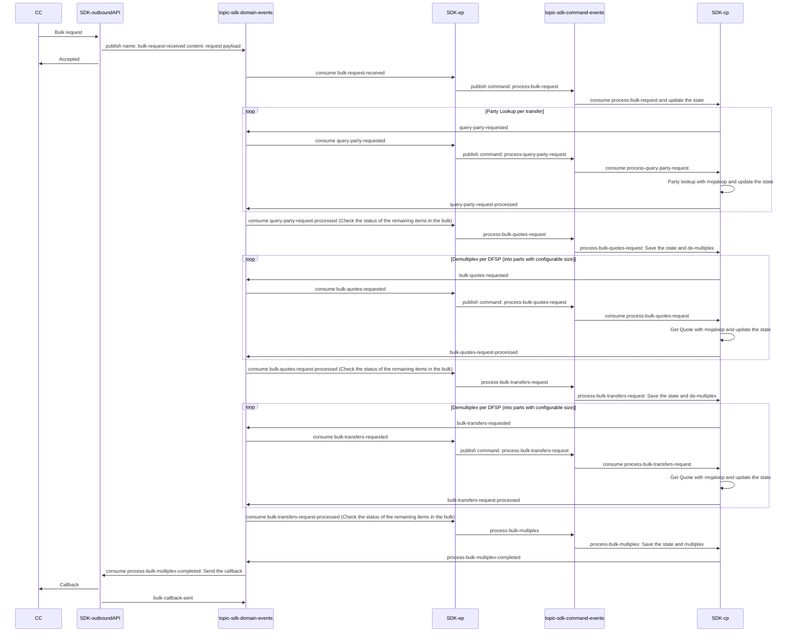

### Sequence Diagram

### References:

https://mojaloop.github.io/reference-architecture-doc/boundedContexts/accountLookupAndDiscovery/

https://github.com/mojaloop/platform-shared-lib/tree/main/modules/nodejs-kafka-client-lib