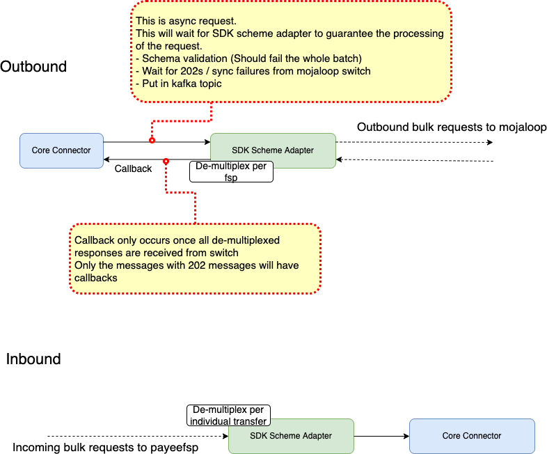

### Overview

### [Outbound Sequence Diagram](./outbound-sequence.md)

### [Inbound Sequence Diagram](./inbound-sequence.md)

### References:

https://mojaloop.github.io/reference-architecture-doc/boundedContexts/accountLookupAndDiscovery/

https://github.com/mojaloop/platform-shared-lib/tree/main/modules/nodejs-kafka-client-lib

### Notes

- Define "Update states" clearly
- AutoAccept use cases
- Structure of the redis object that we are storing (HSET <bulkID>?)
- Refer the reference-architecture for the naming and message formats (https://mojaloop.github.io/reference-architecture-doc/boundedContexts/quotingAgreement/)
- Create a story for transforming sdk-scheme-adapter repo as mono repo for both javascript and typescript
- How to handle timeouts? Using a scheduler that can fire timeout events? Scheduling BC?
- Outbound mojaloop async requests (Follow the redis pub-sub / implement kafka solution to handle callbacks)
- Calculate the timeouts for individual transfers based on the bulk timeout.
