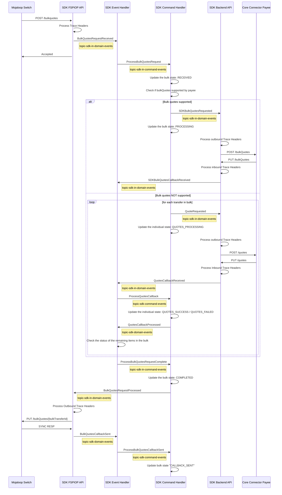

### Inbound Sequence Diagram

```mermaid
sequenceDiagram
    participant MojaloopSwitch as Mojaloop Switch
    participant SDKFspiopApi as SDK FSPIOP API
    participant SDKEventHandler as SDK Event Handler
    participant SDKCommandHandler as SDK Command Handler
    participant SDKBackendApi as SDK Backend API
    participant CoreConnector as Core Connector Payee
   
    MojaloopSwitch->>+SDKFspiopApi: POST /bulkquotes
    SDKFspiopApi->>SDKFspiopApi: Process Trace Headers
    SDKFspiopApi->>SDKEventHandler: BulkQuotesRequestReceived
    Note left of SDKEventHandler: topic-sdk-in-domain-events
    SDKFspiopApi->>MojaloopSwitch: Accepted
    SDKEventHandler->>SDKCommandHandler: ProcessBulkQuotesRequest
    Note left of SDKCommandHandler: topic-sdk-in-command-events
    SDKCommandHandler->>SDKCommandHandler: Update the bulk state: RECEIVED
    SDKCommandHandler->>SDKCommandHandler: Check if bulkQuotes supported by payee

    alt Bulk quotes supported
        SDKCommandHandler->>SDKBackendApi: SDKBulkQuotesRequested
        Note left of SDKBackendApi: topic-sdk-in-domain-events
        SDKCommandHandler->>SDKCommandHandler: Update the bulk state: PROCESSING
        SDKBackendApi->>SDKBackendApi: Process outbound Trace Headers
        SDKBackendApi->>CoreConnector: POST /bulkQuotes
        CoreConnector->>SDKBackendApi: PUT /bulkQuotes
        SDKBackendApi->>SDKBackendApi: Process inbound Trace Headers
        SDKBackendApi->>SDKEventHandler: SDKBulkQuotesCallbackReceived
        Note right of SDKEventHandler: topic-sdk-in-domain-events
    else Bulk quotes NOT supported
        loop for each transfer in bulk
            SDKCommandHandler->>SDKBackendApi: QuoteRequested
            Note left of SDKBackendApi: topic-sdk-in-domain-events
            SDKCommandHandler->>SDKCommandHandler: Update the individual state: QUOTES_PROCESSING
            SDKBackendApi->>SDKBackendApi: Process outbound Trace Headers
            SDKBackendApi->>CoreConnector: POST /quotes
            CoreConnector->>SDKBackendApi: PUT /quotes
            SDKBackendApi->>SDKBackendApi: Process Inbound Trace Headers
            SDKBackendApi->>SDKEventHandler: QuotesCallbackReceived
            Note right of SDKEventHandler: topic-sdk-in-domain-events
            SDKEventHandler->>SDKCommandHandler: ProcessQuotesCallback
            Note left of SDKCommandHandler: topic-sdk-command-events
            SDKCommandHandler->>SDKCommandHandler: Update the individual state: QUOTES_SUCCESS / QUOTES_FAILED
            SDKCommandHandler->>SDKEventHandler: QuotesCallbackProcessed
            Note right of SDKEventHandler: topic-sdk-domain-events
            SDKEventHandler->>SDKEventHandler: Check the status of the remaining items in the bulk
        end
    end
    SDKEventHandler->>SDKCommandHandler: ProcessBulkQuotesRequestComplete
    Note left of SDKCommandHandler: topic-sdk-in-command-events
    SDKCommandHandler->>SDKCommandHandler: Update the bulk state: COMPLETED
    SDKCommandHandler->>SDKFspiopApi: BulkQuotesRequestProcessed
    Note right of SDKFspiopApi: topic-sdk-in-domain-events
    SDKFspiopApi->>SDKFspiopApi: Process Outbound Trace Headers
    SDKFspiopApi->>MojaloopSwitch: PUT /bulkQuotes/{bulkTransferId}
    MojaloopSwitch->>SDKFspiopApi: SYNC RESP
    SDKFspiopApi->>SDKEventHandler: BulkQuotesCallbackSent
    Note left of SDKEventHandler: topic-sdk-domain-events
    SDKEventHandler->>SDKCommandHandler: ProcessBulkQuotesCallbackSent
    Note left of SDKCommandHandler: topic-sdk-command-events
    SDKCommandHandler->>SDKCommandHandler: Update bulk state "CALLBACK_SENT"

```
