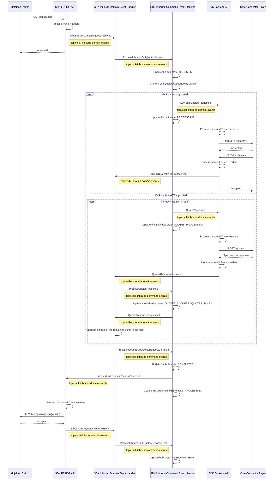

### Inbound Sequence Diagram

```mermaid
sequenceDiagram
    participant MojaloopSwitch as Mojaloop Switch
    participant SDKFspiopApi as SDK FSPIOP API
    participant SDKInboundDomainEventHandler as SDK Inbound Domain Event Handler
    participant SDKInboundCommandEventHandler as SDK Inbound Command Event Handler
    participant SDKBackendApi as SDK Backend API
    participant CoreConnector as Core Connector Payee
   
    MojaloopSwitch->>+SDKFspiopApi: POST /bulkquotes
    SDKFspiopApi->>SDKFspiopApi: Process Trace Headers
    SDKFspiopApi->>SDKInboundDomainEventHandler: InboundBulkQuotesRequestReceived
    Note left of SDKInboundDomainEventHandler: topic-sdk-inbound-domain-events
    SDKFspiopApi-->>MojaloopSwitch: Accepted
    SDKInboundDomainEventHandler->>SDKInboundCommandEventHandler: ProcessInboundBulkQuotesRequest
    Note left of SDKInboundCommandEventHandler: topic-sdk-inbound-command-events
    SDKInboundCommandEventHandler->>SDKInboundCommandEventHandler: Update the bulk state: RECEIVED
    SDKInboundCommandEventHandler->>SDKInboundCommandEventHandler: Check if bulkQuotes supported by payee

    alt Bulk quotes supported
        SDKInboundCommandEventHandler->>SDKBackendApi: SDKBulkQuotesRequested
        Note left of SDKBackendApi: topic-sdk-inbound-domain-events
        SDKInboundCommandEventHandler->>SDKInboundCommandEventHandler: Update the bulk state: PROCESSING
        SDKBackendApi->>SDKBackendApi: Process outbound Trace Headers
        SDKBackendApi->>CoreConnector: POST /bulkQuotes
        CoreConnector-->>SDKBackendApi: Accepted
        CoreConnector->>SDKBackendApi: PUT /bulkQuotes
        SDKBackendApi->>SDKBackendApi: Process inbound Trace Headers
        SDKBackendApi->>SDKInboundDomainEventHandler: SDKBulkQuotesCallbackReceived
        Note right of SDKInboundDomainEventHandler: topic-sdk-inbound-domain-events
        SDKBackendApi-->>CoreConnector: Accepted
    else Bulk quotes NOT supported
        loop for each transfer in bulk
            SDKInboundCommandEventHandler->>SDKBackendApi: QuoteRequested
            Note left of SDKBackendApi: topic-sdk-inbound-domain-events
            SDKInboundCommandEventHandler->>SDKInboundCommandEventHandler: Update the individual state: QUOTES_PROCESSING
            SDKBackendApi->>SDKBackendApi: Process outbound Trace Headers
            SDKBackendApi->>CoreConnector: POST /quotes
            CoreConnector-->>SDKBackendApi: Synchronous response
            SDKBackendApi->>SDKBackendApi: Process Inbound Trace Headers
            SDKBackendApi->>SDKInboundDomainEventHandler: QuotesResponseReceived
            Note right of SDKInboundDomainEventHandler: topic-sdk-inbound-domain-events
            SDKInboundDomainEventHandler->>SDKInboundCommandEventHandler: ProcessQuotesResponse
            Note left of SDKInboundCommandEventHandler: topic-sdk-inbound-command-events
            SDKInboundCommandEventHandler->>SDKInboundCommandEventHandler: Update the individual state: QUOTES_SUCCESS / QUOTES_FAILED
            SDKInboundCommandEventHandler->>SDKInboundDomainEventHandler: QuotesResponseProcessed
            Note right of SDKInboundDomainEventHandler: topic-sdk-inbound-domain-events
            SDKInboundDomainEventHandler->>SDKInboundDomainEventHandler: Check the status of the remaining items in the bulk
        end
    end
    SDKInboundDomainEventHandler->>SDKInboundCommandEventHandler: ProcessInboundBulkQuotesRequestComplete
    Note left of SDKInboundCommandEventHandler: topic-sdk-inbound-command-events
    SDKInboundCommandEventHandler->>SDKInboundCommandEventHandler: Update the bulk state: COMPLETED
    SDKInboundCommandEventHandler->>SDKFspiopApi: InboundBulkQuotesRequestProcessed
    Note right of SDKFspiopApi: topic-sdk-inbound-domain-events
    SDKInboundCommandEventHandler->>SDKInboundCommandEventHandler: Update the bulk state: RESPONSE_PROCESSING
    SDKFspiopApi->>SDKFspiopApi: Process Outbound Trace Headers
    SDKFspiopApi->>MojaloopSwitch: PUT /bulkQuotes/{bulkQuoteId}
    MojaloopSwitch-->>SDKFspiopApi: Accepted
    SDKFspiopApi->>SDKInboundDomainEventHandler: InboundBulkQuotesReponseSent
    Note left of SDKInboundDomainEventHandler: topic-sdk-inbound-domain-events
    SDKInboundDomainEventHandler->>SDKInboundCommandEventHandler: ProcessInboundBulkQuotesReponseSent
    Note left of SDKInboundCommandEventHandler: topic-sdk-inbound-command-events
    SDKInboundCommandEventHandler->>SDKInboundCommandEventHandler: Update bulk state "RESPONSE_SENT"

```
