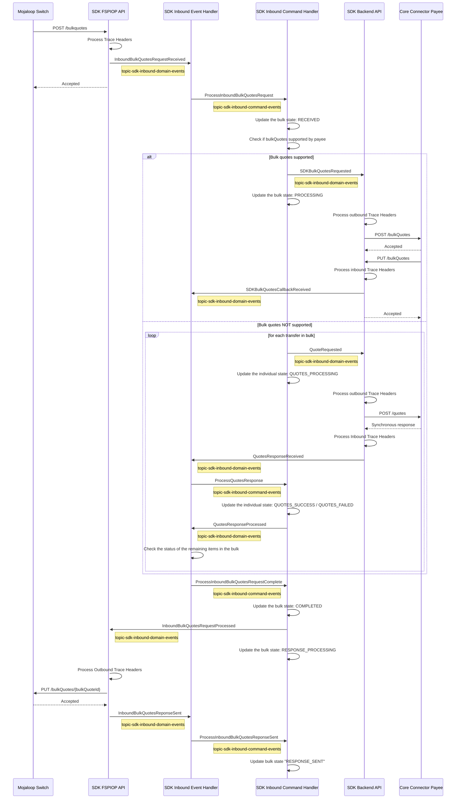

### Inbound Sequence Diagram

```mermaid
sequenceDiagram
    participant MojaloopSwitch as Mojaloop Switch
    participant SDKFspiopApi as SDK FSPIOP API
    participant SDKInboundEventHandler as SDK Inbound Event Handler
    participant SDKInboundCommandHandler as SDK Inbound Command Handler
    participant SDKBackendApi as SDK Backend API
    participant CoreConnector as Core Connector Payee
   
    MojaloopSwitch->>+SDKFspiopApi: POST /bulkquotes
    SDKFspiopApi->>SDKFspiopApi: Process Trace Headers
    SDKFspiopApi->>SDKInboundEventHandler: InboundBulkQuotesRequestReceived
    Note left of SDKInboundEventHandler: topic-sdk-inbound-domain-events
    SDKFspiopApi-->>MojaloopSwitch: Accepted
    SDKInboundEventHandler->>SDKInboundCommandHandler: ProcessInboundBulkQuotesRequest
    Note left of SDKInboundCommandHandler: topic-sdk-inbound-command-events
    SDKInboundCommandHandler->>SDKInboundCommandHandler: Update the bulk state: RECEIVED
    SDKInboundCommandHandler->>SDKInboundCommandHandler: Check if bulkQuotes supported by payee

    alt Bulk quotes supported
        SDKInboundCommandHandler->>SDKBackendApi: SDKBulkQuotesRequested
        Note left of SDKBackendApi: topic-sdk-inbound-domain-events
        SDKInboundCommandHandler->>SDKInboundCommandHandler: Update the bulk state: PROCESSING
        SDKBackendApi->>SDKBackendApi: Process outbound Trace Headers
        SDKBackendApi->>CoreConnector: POST /bulkQuotes
        CoreConnector-->>SDKBackendApi: Accepted
        CoreConnector->>SDKBackendApi: PUT /bulkQuotes
        SDKBackendApi->>SDKBackendApi: Process inbound Trace Headers
        SDKBackendApi->>SDKInboundEventHandler: SDKBulkQuotesCallbackReceived
        Note right of SDKInboundEventHandler: topic-sdk-inbound-domain-events
        SDKBackendApi-->>CoreConnector: Accepted
    else Bulk quotes NOT supported
        loop for each transfer in bulk
            SDKInboundCommandHandler->>SDKBackendApi: QuoteRequested
            Note left of SDKBackendApi: topic-sdk-inbound-domain-events
            SDKInboundCommandHandler->>SDKInboundCommandHandler: Update the individual state: QUOTES_PROCESSING
            SDKBackendApi->>SDKBackendApi: Process outbound Trace Headers
            SDKBackendApi->>CoreConnector: POST /quotes
            CoreConnector-->>SDKBackendApi: Synchronous response
            SDKBackendApi->>SDKBackendApi: Process Inbound Trace Headers
            SDKBackendApi->>SDKInboundEventHandler: QuotesResponseReceived
            Note right of SDKInboundEventHandler: topic-sdk-inbound-domain-events
            SDKInboundEventHandler->>SDKInboundCommandHandler: ProcessQuotesResponse
            Note left of SDKInboundCommandHandler: topic-sdk-inbound-command-events
            SDKInboundCommandHandler->>SDKInboundCommandHandler: Update the individual state: QUOTES_SUCCESS / QUOTES_FAILED
            SDKInboundCommandHandler->>SDKInboundEventHandler: QuotesResponseProcessed
            Note right of SDKInboundEventHandler: topic-sdk-inbound-domain-events
            SDKInboundEventHandler->>SDKInboundEventHandler: Check the status of the remaining items in the bulk
        end
    end
    SDKInboundEventHandler->>SDKInboundCommandHandler: ProcessInboundBulkQuotesRequestComplete
    Note left of SDKInboundCommandHandler: topic-sdk-inbound-command-events
    SDKInboundCommandHandler->>SDKInboundCommandHandler: Update the bulk state: COMPLETED
    SDKInboundCommandHandler->>SDKFspiopApi: InboundBulkQuotesRequestProcessed
    Note right of SDKFspiopApi: topic-sdk-inbound-domain-events
    SDKInboundCommandHandler->>SDKInboundCommandHandler: Update the bulk state: RESPONSE_PROCESSING
    SDKFspiopApi->>SDKFspiopApi: Process Outbound Trace Headers
    SDKFspiopApi->>MojaloopSwitch: PUT /bulkQuotes/{bulkQuoteId}
    MojaloopSwitch-->>SDKFspiopApi: Accepted
    SDKFspiopApi->>SDKInboundEventHandler: InboundBulkQuotesReponseSent
    Note left of SDKInboundEventHandler: topic-sdk-inbound-domain-events
    SDKInboundEventHandler->>SDKInboundCommandHandler: ProcessInboundBulkQuotesReponseSent
    Note left of SDKInboundCommandHandler: topic-sdk-inbound-command-events
    SDKInboundCommandHandler->>SDKInboundCommandHandler: Update bulk state "RESPONSE_SENT"

```
