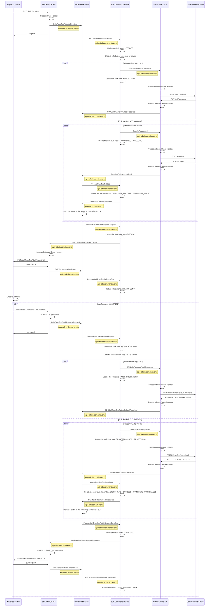

### Inbound Sequence Diagram

```mermaid
sequenceDiagram
    participant MojaloopSwitch as Mojaloop Switch
    participant SDKFspiopApi as SDK FSPIOP API
    participant SDKEventHandler as SDK Event Handler
    participant SDKCommandHandler as SDK Command Handler
    participant SDKBackendApi as SDK Backend API
    participant CoreConnector as Core Connector Payee

    MojaloopSwitch->>+SDKFspiopApi: POST /bulkTransfers
    SDKFspiopApi->>SDKFspiopApi: Process Trace Headers
    SDKFspiopApi->>SDKEventHandler: BulkTransfersRequestReceived
    Note left of SDKEventHandler: topic-sdk-in-domain-events
    SDKFspiopApi->>MojaloopSwitch: Accepted
    SDKEventHandler->>SDKCommandHandler: ProcessBulkTransfersRequest
    Note left of SDKCommandHandler: topic-sdk-in-command-events
    SDKCommandHandler->>SDKCommandHandler: Update the bulk state: RECEIVED
    SDKCommandHandler->>SDKCommandHandler: Check if bulkQuotes supported by payee

    alt Bulk transfers supported
        SDKCommandHandler->>SDKBackendApi: SDKBulkTransfersRequested
        Note left of SDKBackendApi: topic-sdk-in-domain-events
        SDKCommandHandler->>SDKCommandHandler: Update the bulk state: PROCESSING
        SDKBackendApi->>SDKBackendApi: Process outbound Trace Headers
        SDKBackendApi->>CoreConnector: POST /bulkTransfers
        CoreConnector->>SDKBackendApi: PUT /bulkTransfers
        SDKBackendApi->>SDKBackendApi: Process inbound Trace Headers
        SDKBackendApi->>SDKEventHandler: SDKBulkTransfersCallbackReceived
        Note right of SDKEventHandler: topic-sdk-in-domain-events
    else Bulk transfers NOT supported
        loop for each transfer in bulk
            SDKCommandHandler->>SDKBackendApi: TransferRequested
            Note left of SDKBackendApi: topic-sdk-in-domain-events
            SDKCommandHandler->>SDKCommandHandler: Update the individual state: TRANSFERS_PROCESSING
            SDKBackendApi->>SDKBackendApi: Process outbound Trace Headers
            SDKBackendApi->>CoreConnector: POST /transfers
            CoreConnector->>SDKBackendApi: PUT /transfers
            SDKBackendApi->>SDKBackendApi: Process Inbound Trace Headers
            SDKBackendApi->>SDKEventHandler: TransfersCallbackReceived
            Note right of SDKEventHandler: topic-sdk-in-domain-events
            SDKEventHandler->>SDKCommandHandler: ProcessTransfersCallback
            Note left of SDKCommandHandler: topic-sdk-command-events
            SDKCommandHandler->>SDKCommandHandler: Update the individual state: TRANSFERS_SUCCESS / TRANSFERS_FAILED
            SDKCommandHandler->>SDKEventHandler: TransfersCallbackProcessed
            Note right of SDKEventHandler: topic-sdk-domain-events
            SDKEventHandler->>SDKEventHandler: Check the status of the remaining items in the bulk
        end
    end
    SDKEventHandler->>SDKCommandHandler: ProcessBulkTransfersRequestComplete
    Note left of SDKCommandHandler: topic-sdk-in-command-events
    SDKCommandHandler->>SDKCommandHandler: Update the bulk state: COMPLETED?
    SDKCommandHandler->>SDKFspiopApi: BulkTransfersRequestProcessed
    Note right of SDKFspiopApi: topic-sdk-in-domain-events
    SDKFspiopApi->>SDKFspiopApi: Process Outbound Trace Headers
    SDKFspiopApi->>MojaloopSwitch: PUT /bulkTransfers/{bulkTransferId}
    MojaloopSwitch->>SDKFspiopApi: SYNC RESP
    SDKFspiopApi->>SDKEventHandler: BulkTransfersCallbackSent
    Note left of SDKEventHandler: topic-sdk-domain-events
    SDKEventHandler->>SDKCommandHandler: ProcessBulkTransfersCallbackSent
    Note left of SDKCommandHandler: topic-sdk-command-events
    SDKCommandHandler->>SDKCommandHandler: Update bulk state "CALLBACK_SENT"


    MojaloopSwitch->>MojaloopSwitch: Check bulkStatus

    alt bulkStatus == 'ACCEPTED'
        MojaloopSwitch->>+SDKFspiopApi: PATCH /bulkTransfers/{bulkTransferId}
        SDKFspiopApi->>SDKFspiopApi: Process Trace Headers
        SDKFspiopApi->>SDKEventHandler: BulkTransfersPatchRequestReceived
        Note left of SDKEventHandler: topic-sdk-in-domain-events
        SDKFspiopApi->>MojaloopSwitch: Accepted
        SDKEventHandler->>SDKCommandHandler: ProcessBulkTransfersPatchRequest
        Note left of SDKCommandHandler: topic-sdk-in-command-events
        SDKCommandHandler->>SDKCommandHandler: Update the bulk state: PATCH_RECEIVED
        SDKCommandHandler->>SDKCommandHandler: Check if bulkTransfers supported by payee
        alt Bulk transfers supported
            SDKCommandHandler->>SDKBackendApi: SDKBulkTransfersPatchRequested
            Note left of SDKBackendApi: topic-sdk-in-domain-events
            SDKCommandHandler->>SDKCommandHandler: Update the bulk state: PATCH_PROCESSING
            SDKBackendApi->>SDKBackendApi: Process outbound Trace Headers
            SDKBackendApi->>CoreConnector: PATCH /bulkTransfers/{bulkTransferId}
            CoreConnector->>SDKBackendApi: Response to Patch /bulkTransfers
            SDKBackendApi->>SDKBackendApi: Process inbound Trace Headers
            SDKBackendApi->>SDKEventHandler: SDKBulkTransfersPatchCallbackReceived
            Note right of SDKEventHandler: topic-sdk-in-domain-events
        else Bulk transfers NOT supported
            loop for each transfer in bulk
              SDKCommandHandler->>SDKBackendApi: TransfersPatchRequested
              Note left of SDKBackendApi: topic-sdk-in-domain-events
              SDKCommandHandler->>SDKCommandHandler: Update the individual state: TRANSFERS_PATCH_PROCESSING
              SDKBackendApi->>SDKBackendApi: Process outbound Trace Headers
              SDKBackendApi->>CoreConnector: PATCH /transfers/{transferId}
              CoreConnector->>SDKBackendApi: Response to PATCH /transfers
              SDKBackendApi->>SDKBackendApi: Process Inbound Trace Headers
              SDKBackendApi->>SDKEventHandler: TransfersPatchCallbackReceived
              Note right of SDKEventHandler: topic-sdk-in-domain-events
              SDKEventHandler->>SDKCommandHandler: ProcessTransfersPatchCallback
              Note left of SDKCommandHandler: topic-sdk-command-events
              SDKCommandHandler->>SDKCommandHandler: Update the individual state: TRANSFERS_PATCH_SUCCESS / TRANSFERS_PATCH_FAILED
              SDKCommandHandler->>SDKEventHandler: TransfersPatchCallbackProcessed
              Note right of SDKEventHandler: topic-sdk-domain-events
              SDKEventHandler->>SDKEventHandler: Check the status of the remaining items in the bulk
            end
        end

        SDKEventHandler->>SDKCommandHandler: ProcessBulkTransfersPatchRequestComplete
        Note left of SDKCommandHandler: topic-sdk-in-command-events
        SDKCommandHandler->>SDKCommandHandler: Update the bulk state: COMPLETED
        SDKCommandHandler->>SDKFspiopApi: BulkTransfersPatchRequestProcessed
        Note right of SDKFspiopApi: topic-sdk-in-domain-events
        SDKFspiopApi->>SDKFspiopApi: Process Outbound Trace Headers
        SDKFspiopApi->>MojaloopSwitch: PUT /bulkTransfers/{bulkTransferId}
        MojaloopSwitch->>SDKFspiopApi: SYNC RESP
        SDKFspiopApi->>SDKEventHandler: BulkTransfersPatchCallbackSent
        Note left of SDKEventHandler: topic-sdk-domain-events
        SDKEventHandler->>SDKCommandHandler: ProcessBulkTransfersPatchCallbackSent
        Note left of SDKCommandHandler: topic-sdk-command-events
        SDKCommandHandler->>SDKCommandHandler: Update bulk state "PATCH_CALLBACK_SENT"
    end
```
