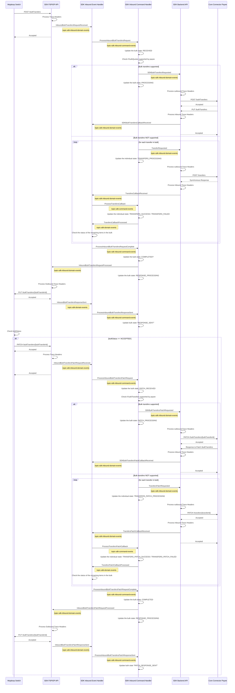

### Inbound Sequence Diagram

```mermaid
sequenceDiagram
    participant MojaloopSwitch as Mojaloop Switch
    participant SDKFspiopApi as SDK FSPIOP API
    participant SDKInboundEventHandler as SDK Inbound Event Handler
    participant SDKInboundCommandHandler as SDK Inbound Command Handler
    participant SDKBackendApi as SDK Backend API
    participant CoreConnector as Core Connector Payee

    MojaloopSwitch->>+SDKFspiopApi: POST /bulkTransfers
    SDKFspiopApi->>SDKFspiopApi: Process Trace Headers
    SDKFspiopApi->>SDKInboundEventHandler: InboundBulkTransfersRequestReceived
    Note left of SDKInboundEventHandler: topic-sdk-inbound-domain-events
    SDKFspiopApi-->>MojaloopSwitch: Accepted
    SDKInboundEventHandler->>SDKInboundCommandHandler: ProcessInboundBulkTransfersRequest
    Note left of SDKInboundCommandHandler: topic-sdk-inbound-command-events
    SDKInboundCommandHandler->>SDKInboundCommandHandler: Update the bulk state: RECEIVED
    SDKInboundCommandHandler->>SDKInboundCommandHandler: Check if bulkQuotes supported by payee

    alt Bulk transfers supported
        SDKInboundCommandHandler->>SDKBackendApi: SDKBulkTransfersRequested
        Note left of SDKBackendApi: topic-sdk-inbound-domain-events
        SDKInboundCommandHandler->>SDKInboundCommandHandler: Update the bulk state: PROCESSING
        SDKBackendApi->>SDKBackendApi: Process outbound Trace Headers
        SDKBackendApi->>CoreConnector: POST /bulkTransfers
        CoreConnector-->>SDKBackendApi: Accepted
        CoreConnector->>SDKBackendApi: PUT /bulkTransfers
        SDKBackendApi->>SDKBackendApi: Process inbound Trace Headers
        SDKBackendApi->>SDKInboundEventHandler: SDKBulkTransfersCallbackReceived
        Note right of SDKInboundEventHandler: topic-sdk-inbound-domain-events
        SDKBackendApi-->>CoreConnector: Accepted
    else Bulk transfers NOT supported
        loop for each transfer in bulk
            SDKInboundCommandHandler->>SDKBackendApi: TransferRequested
            Note left of SDKBackendApi: topic-sdk-inbound-domain-events
            SDKInboundCommandHandler->>SDKInboundCommandHandler: Update the individual state: TRANSFERS_PROCESSING
            SDKBackendApi->>SDKBackendApi: Process outbound Trace Headers
            SDKBackendApi->>CoreConnector: POST /transfers
            CoreConnector-->>SDKBackendApi: Synchronous Response
            SDKBackendApi->>SDKBackendApi: Process Inbound Trace Headers
            SDKBackendApi->>SDKInboundEventHandler: TransfersCallbackReceived
            Note right of SDKInboundEventHandler: topic-sdk-inbound-domain-events
            SDKInboundEventHandler->>SDKInboundCommandHandler: ProcessTransfersCallback
            Note left of SDKInboundCommandHandler: topic-sdk-command-events
            SDKInboundCommandHandler->>SDKInboundCommandHandler: Update the individual state: TRANSFERS_SUCCESS / TRANSFERS_FAILED
            SDKInboundCommandHandler->>SDKInboundEventHandler: TransfersCallbackProcessed
            Note right of SDKInboundEventHandler: topic-sdk-domain-events
            SDKInboundEventHandler->>SDKInboundEventHandler: Check the status of the remaining items in the bulk
        end
    end
    SDKInboundEventHandler->>SDKInboundCommandHandler: ProcessInboundBulkTransfersRequestComplete
    Note left of SDKInboundCommandHandler: topic-sdk-inbound-command-events
    SDKInboundCommandHandler->>SDKInboundCommandHandler: Update the bulk state: COMPLETED?
    SDKInboundCommandHandler->>SDKFspiopApi: InboundBulkTransfersRequestProcessed
    Note right of SDKFspiopApi: topic-sdk-inbound-domain-events
    SDKInboundCommandHandler->>SDKInboundCommandHandler: Update the bulk state: RESPONSE_PROCESSING
    SDKFspiopApi->>SDKFspiopApi: Process Outbound Trace Headers
    SDKFspiopApi->>MojaloopSwitch: PUT /bulkTransfers/{bulkTransferId}
    MojaloopSwitch-->>SDKFspiopApi: Accepted
    SDKFspiopApi->>SDKInboundEventHandler: InboundBulkTransfersResponseSent
    Note left of SDKInboundEventHandler: topic-sdk-domain-events
    SDKInboundEventHandler->>SDKInboundCommandHandler: ProcessInboundBulkTransfersResponseSent
    Note left of SDKInboundCommandHandler: topic-sdk-inbound-command-events
    SDKInboundCommandHandler->>SDKInboundCommandHandler: Update bulk state "RESPONSE_SENT"


    MojaloopSwitch->>MojaloopSwitch: Check bulkStatus

    alt bulkStatus == 'ACCEPTED'
        MojaloopSwitch->>+SDKFspiopApi: PATCH /bulkTransfers/{bulkTransferId}
        SDKFspiopApi-->>MojaloopSwitch: Accepted
        SDKFspiopApi->>SDKFspiopApi: Process Trace Headers
        SDKFspiopApi->>SDKInboundEventHandler: InboundBulkTransfersPatchRequestReceived
        Note left of SDKInboundEventHandler: topic-sdk-inbound-domain-events
        SDKFspiopApi-->>MojaloopSwitch: Accepted
        SDKInboundEventHandler->>SDKInboundCommandHandler: ProcessInboundBulkTransfersPatchRequest
        Note left of SDKInboundCommandHandler: topic-sdk-inbound-command-events
        SDKInboundCommandHandler->>SDKInboundCommandHandler: Update the bulk state: PATCH_RECEIVED
        SDKInboundCommandHandler->>SDKInboundCommandHandler: Check if bulkTransfers supported by payee
        alt Bulk transfers supported
            SDKInboundCommandHandler->>SDKBackendApi: SDKBulkTransfersPatchRequested
            Note left of SDKBackendApi: topic-sdk-inbound-domain-events
            SDKInboundCommandHandler->>SDKInboundCommandHandler: Update the bulk state: PATCH_PROCESSING
            SDKBackendApi->>SDKBackendApi: Process outbound Trace Headers
            SDKBackendApi->>CoreConnector: PATCH /bulkTransfers/{bulkTransferId}
            CoreConnector-->>SDKBackendApi: Accepted
            CoreConnector->>SDKBackendApi: Response to Patch /bulkTransfers
            SDKBackendApi->>SDKBackendApi: Process inbound Trace Headers
            SDKBackendApi->>SDKInboundEventHandler: SDKBulkTransfersPatchCallbackReceived
            Note right of SDKInboundEventHandler: topic-sdk-inbound-domain-events
            SDKBackendApi-->>CoreConnector: Accepted
        else Bulk transfers NOT supported
            loop for each transfer in bulk
              SDKInboundCommandHandler->>SDKBackendApi: TransfersPatchRequested
              Note left of SDKBackendApi: topic-sdk-inbound-domain-events
              SDKInboundCommandHandler->>SDKInboundCommandHandler: Update the individual state: TRANSFERS_PATCH_PROCESSING
              SDKBackendApi->>SDKBackendApi: Process outbound Trace Headers
              SDKBackendApi->>CoreConnector: PATCH /transfers/{transferId}
              CoreConnector-->>SDKBackendApi: Accepted
              SDKBackendApi->>SDKBackendApi: Process Inbound Trace Headers
              SDKBackendApi->>SDKInboundEventHandler: TransfersPatchCallbackReceived
              Note right of SDKInboundEventHandler: topic-sdk-inbound-domain-events
              SDKBackendApi-->>CoreConnector: Accepted
              SDKInboundEventHandler->>SDKInboundCommandHandler: ProcessTransfersPatchCallback
              Note left of SDKInboundCommandHandler: topic-sdk-command-events
              SDKInboundCommandHandler->>SDKInboundCommandHandler: Update the individual state: TRANSFERS_PATCH_SUCCESS / TRANSFERS_PATCH_FAILED
              SDKInboundCommandHandler->>SDKInboundEventHandler: TransfersPatchCallbackProcessed
              Note right of SDKInboundEventHandler: topic-sdk-domain-events
              SDKInboundEventHandler->>SDKInboundEventHandler: Check the status of the remaining items in the bulk
            end
        end

        SDKInboundEventHandler->>SDKInboundCommandHandler: ProcessInboundBulkTransfersPatchRequestComplete
        Note left of SDKInboundCommandHandler: topic-sdk-inbound-command-events
        SDKInboundCommandHandler->>SDKInboundCommandHandler: Update the bulk state: COMPLETED
        SDKInboundCommandHandler->>SDKFspiopApi: InboundBulkTransfersPatchRequestProcessed
        Note right of SDKFspiopApi: topic-sdk-inbound-domain-events
        SDKInboundCommandHandler->>SDKInboundCommandHandler: Update the bulk state: RESPONSE_PROCESSING
        SDKFspiopApi->>SDKFspiopApi: Process Outbound Trace Headers
        SDKFspiopApi->>MojaloopSwitch: PUT /bulkTransfers/{bulkTransferId}
        MojaloopSwitch-->>SDKFspiopApi: Accepted
        SDKFspiopApi->>SDKInboundEventHandler: InboundBulkTransfersPatchResponseSent
        Note left of SDKInboundEventHandler: topic-sdk-inbound-domain-events
        SDKInboundEventHandler->>SDKInboundCommandHandler: ProcessInboundBulkTransfersPatchResponseSent
        Note left of SDKInboundCommandHandler: topic-sdk-inbound-command-events
        SDKInboundCommandHandler->>SDKInboundCommandHandler: Update bulk state "PATCH_RESPONSE_SENT"
    end
```
