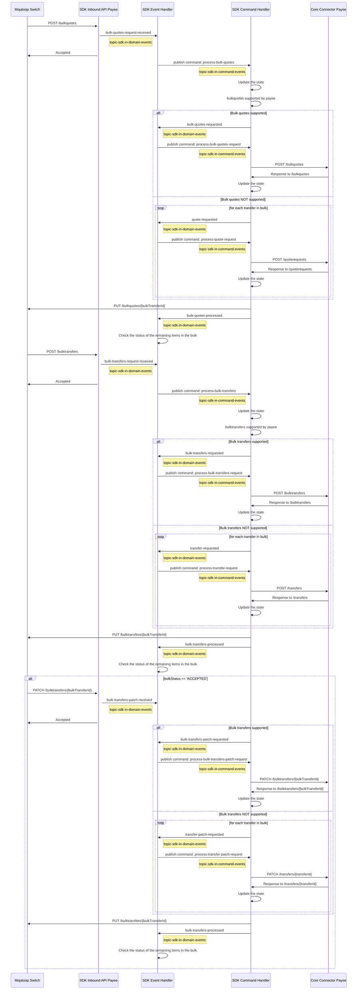

### Inbound Sequence Diagram

```mermaid
sequenceDiagram
    participant MojaloopSwitch as Mojaloop Switch
    participant SDKInboundAPI as SDK Inbound API Payee
    participant SDKEventHandler as SDK Event Handler
    participant SDKCommandHandler as SDK Command Handler
    participant CoreConnector as Core Connector Payee
   
    MojaloopSwitch->>+SDKInboundAPI: POST /bulkquotes
    SDKInboundAPI->>SDKEventHandler: bulk-quotes-request-received
    Note left of SDKEventHandler: topic-sdk-in-domain-events
    SDKInboundAPI->>MojaloopSwitch: Accepted
    SDKEventHandler->>SDKCommandHandler: publish command: process-bulk-quotes
    Note left of SDKCommandHandler: topic-sdk-in-command-events
    SDKCommandHandler->>SDKCommandHandler: Update the state
    SDKCommandHandler->>SDKCommandHandler: bulkquotes supported by payee

    alt Bulk quotes supported
        SDKCommandHandler->>SDKEventHandler: bulk-quotes-requested
        Note right of SDKEventHandler: topic-sdk-in-domain-events
        SDKEventHandler->>SDKCommandHandler: publish command: process-bulk-quotes-request
        Note left of SDKCommandHandler: topic-sdk-in-command-events
        SDKCommandHandler->>CoreConnector: POST /bulkquotes
        CoreConnector->>SDKCommandHandler: Response to /bulkquotes
        SDKCommandHandler->>SDKCommandHandler: Update the state
    else Bulk quotes NOT supported
        loop for each transfer in bulk
            SDKCommandHandler->>SDKEventHandler: quote-requested
            Note right of SDKEventHandler: topic-sdk-in-domain-events
            SDKEventHandler->>SDKCommandHandler: publish command: process-quote-request
            Note left of SDKCommandHandler: topic-sdk-in-command-events
            SDKCommandHandler->>CoreConnector: POST /quoterequests
            CoreConnector->>SDKCommandHandler: Response to /quoterequests
            SDKCommandHandler->>SDKCommandHandler: Update the state

        end
    end
    SDKCommandHandler->>MojaloopSwitch: PUT /bulkquotes/{bulkTransferId}
    SDKCommandHandler->>SDKEventHandler: bulk-quotes-processed
    Note right of SDKEventHandler: topic-sdk-in-domain-events
    SDKEventHandler->>SDKEventHandler: Check the status of the remaining items in the bulk

    MojaloopSwitch->>+SDKInboundAPI: POST /bulktransfers
    SDKInboundAPI->>SDKEventHandler: bulk-transfers-request-received
    Note left of SDKEventHandler: topic-sdk-in-domain-events
    SDKInboundAPI->>MojaloopSwitch: Accepted
    SDKEventHandler->>SDKCommandHandler: publish command: process-bulk-transfers
    Note left of SDKCommandHandler: topic-sdk-in-command-events
    SDKCommandHandler->>SDKCommandHandler: Update the state
    SDKCommandHandler->>SDKCommandHandler: bulktransfers supported by payee

    alt Bulk transfers supported
        SDKCommandHandler->>SDKEventHandler: bulk-transfers-requested
        Note right of SDKEventHandler: topic-sdk-in-domain-events
        SDKEventHandler->>SDKCommandHandler: publish command: process-bulk-transfers-request
        Note left of SDKCommandHandler: topic-sdk-in-command-events
        SDKCommandHandler->>CoreConnector: POST /bulktransfers
        CoreConnector->>SDKCommandHandler: Response to /bulktransfers
        SDKCommandHandler->>SDKCommandHandler: Update the state
    else Bulk transfers NOT supported
        loop for each transfer in bulk
            SDKCommandHandler->>SDKEventHandler: transfer-requested
            Note right of SDKEventHandler: topic-sdk-in-domain-events
            SDKEventHandler->>SDKCommandHandler: publish command: process-transfer-request
            Note left of SDKCommandHandler: topic-sdk-in-command-events
            SDKCommandHandler->>CoreConnector: POST /transfers
            CoreConnector->>SDKCommandHandler: Response to /transfers
            SDKCommandHandler->>SDKCommandHandler: Update the state

        end
    end
    SDKCommandHandler->>MojaloopSwitch: PUT /bulktransfers/{bulkTransferId}
    SDKCommandHandler->>SDKEventHandler: bulk-transfers-processed
    Note right of SDKEventHandler: topic-sdk-in-domain-events
    SDKEventHandler->>SDKEventHandler: Check the status of the remaining items in the bulk

    alt bulkStatus == 'ACCEPTED'
        MojaloopSwitch->>+SDKInboundAPI: PATCH /bulktransfers/{bulkTransferId}
        SDKInboundAPI->>SDKEventHandler: bulk-transfers-patch-received
        Note left of SDKEventHandler: topic-sdk-in-domain-events
        SDKInboundAPI->>MojaloopSwitch: Accepted
        alt Bulk transfers supported
            SDKCommandHandler->>SDKEventHandler: bulk-transfers-patch-requested
            Note right of SDKEventHandler: topic-sdk-in-domain-events
            SDKEventHandler->>SDKCommandHandler: publish command: process-bulk-transfers-patch-request
            Note left of SDKCommandHandler: topic-sdk-in-command-events
            SDKCommandHandler->>CoreConnector: PATCH /bulktransfers/{bulkTransferId}
            CoreConnector->>SDKCommandHandler: Response to /bulktransfers/{bulkTransferId}
            SDKCommandHandler->>SDKCommandHandler: Update the state
        else Bulk transfers NOT supported
            loop for each transfer in bulk
                SDKCommandHandler->>SDKEventHandler: transfer-patch-requested
                Note right of SDKEventHandler: topic-sdk-in-domain-events
                SDKEventHandler->>SDKCommandHandler: publish command: process-transfer-patch-request
                Note left of SDKCommandHandler: topic-sdk-in-command-events
                SDKCommandHandler->>CoreConnector: PATCH /transfers/{transferId}
                CoreConnector->>SDKCommandHandler: Response to /transfers/{transferId}
                SDKCommandHandler->>SDKCommandHandler: Update the state

            end
        end
        SDKCommandHandler->>MojaloopSwitch: PUT /bulktransfers/{bulkTransferId}
        SDKCommandHandler->>SDKEventHandler: bulk-transfers-processed
        Note right of SDKEventHandler: topic-sdk-in-domain-events
        SDKEventHandler->>SDKEventHandler: Check the status of the remaining items in the bulk

    end
```
