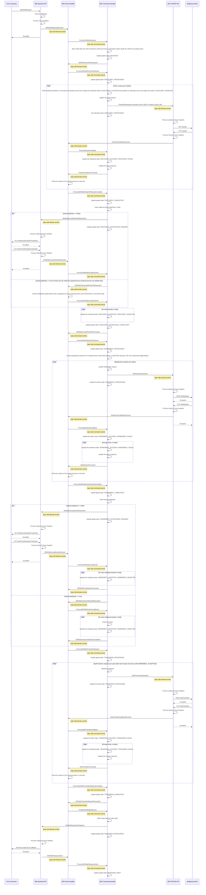

### Outbound Sequence Diagram

```mermaid
sequenceDiagram
    participant CoreConnector as Core Connector
    participant SDKOutboundAPI as SDK Backend API
    participant SDKEventHandler as SDK Event Handler
    participant SDKCommandHandler as SDK Command Handler
    participant SDKFspiopApi as SDK FSPIOP API
    participant MojaloopSwitch as Mojaloop Switch

    CoreConnector->>+SDKOutboundAPI: SDKBulkRequest
    SDKOutboundAPI->>SDKOutboundAPI: Scheme Validation
    SDKOutboundAPI->>SDKOutboundAPI: Process Trace Headers
    SDKOutboundAPI->>SDKEventHandler: SDKBulkRequestReceived
    Note left of SDKEventHandler: topic-sdk-domain-events
    SDKOutboundAPI->>CoreConnector: Accepted
    SDKEventHandler->>SDKCommandHandler: ProcessSDKBulkRequest
    Note left of SDKCommandHandler: topic-sdk-command-events

    SDKCommandHandler->>SDKCommandHandler: Store initial data into redis (Generate UUIDs and map to persistent model, break the JSON into smaller parts)
    SDKCommandHandler->>SDKCommandHandler: Update global state "RECEIVED"

    SDKCommandHandler->>SDKEventHandler: SDKBulkPartyInfoRequested
    Note right of SDKEventHandler: topic-sdk-domain-events
    SDKEventHandler->>SDKCommandHandler: ProcessSDKBulkPartyInfoRequest
    Note left of SDKCommandHandler: topic-sdk-command-events

    SDKCommandHandler->>SDKCommandHandler: Update global state "DISCOVERY_PROCESSING"


    loop Party Lookup per transfer
        SDKCommandHandler->>SDKCommandHandler: Read individual attributes, if the party info already exists then change the individual state to DISCOVERY_SUCCESS else publish the individual event and update the state to DISCOVERY_RECEIVED
        SDKCommandHandler->>SDKCommandHandler: Update the party request
        SDKCommandHandler->>SDKFspiopApi: PartyInfoRequested (includes info for SDK for making a party call)
        Note left of SDKFspiopApi: topic-sdk-domain-events
        SDKCommandHandler->>SDKCommandHandler: Set individual state: DISCOVERY_PROCESSING
        SDKFspiopApi->>SDKFspiopApi: Process outbound Trace Headers
        SDKFspiopApi->>MojaloopSwitch: GET /parties
        MojaloopSwitch->>SDKFspiopApi: PUT /parties
        SDKFspiopApi->>SDKFspiopApi: Process Inbound Trace Headers
        SDKFspiopApi->>SDKEventHandler: PartyInfoCallbackReceived
        Note right of SDKEventHandler: topic-sdk-domain-events
        SDKEventHandler->>SDKCommandHandler: ProcessPartyInfoCallback
        Note left of SDKCommandHandler: topic-sdk-command-events
        SDKCommandHandler->>SDKCommandHandler: Update the individual state: DISCOVERY_SUCCESS / DISCOVERY_FAILED
        SDKCommandHandler->>SDKCommandHandler: Update the party response
        SDKCommandHandler->>SDKEventHandler: PartyInfoCallbackProcessed
        Note right of SDKEventHandler: topic-sdk-domain-events
        SDKEventHandler->>SDKEventHandler: Check the status of the remaining items in the bulk
    end
    SDKEventHandler->>SDKCommandHandler: ProcessSDKBulkPartyInfoRequestComplete
    Note left of SDKCommandHandler: topic-sdk-command-events

    SDKCommandHandler->>SDKCommandHandler: Update global state "DISCOVERY_COMPLETED"
    SDKCommandHandler->>SDKCommandHandler: check optiions.autoAcceptParty in redis

    alt autoAcceptParty == false
        SDKCommandHandler->>SDKOutboundAPI: SDKBulkAcceptPartyInfoRequested
        Note right of SDKOutboundAPI: topic-sdk-domain-events
        SDKCommandHandler->>SDKCommandHandler: Update global state "DISCOVERY_ACCEPTANCE_PENDING"
        SDKOutboundAPI->>SDKOutboundAPI: Process outbound Trace Headers
        SDKOutboundAPI->>CoreConnector: PUT /bulktransfers/{bulkTransferId}
        CoreConnector-->>SDKOutboundAPI: Accepted
        CoreConnector->>+SDKOutboundAPI: PUT /bulkTransfers/{bulkTransferId}
        SDKOutboundAPI->>SDKOutboundAPI: Process inbound Trace Headers
        SDKOutboundAPI->>SDKEventHandler: SDKBulkAcceptPartyInfoReceived
        Note left of SDKEventHandler: topic-sdk-domain-events
        SDKOutboundAPI-->>CoreConnector: Accepted
        SDKEventHandler->>SDKCommandHandler: ProcessSDKBulkAcceptPartyInfo
        Note left of SDKCommandHandler: topic-sdk-command-events

    else autoAcceptParty == true (In future we can make this optional and an external service can handle this)
        SDKCommandHandler->>SDKEventHandler: SDKBulkAutoAcceptPartyInfoRequested
        Note right of SDKEventHandler: topic-sdk-domain-events
        SDKEventHandler->>SDKEventHandler: Create SDKBulkAcceptPartyInfo with acceptParty=true for individual items with DISCOVERY_SUCCESS state
        SDKEventHandler->>SDKCommandHandler: ProcessSDKBulkAcceptPartyInfo
        Note left of SDKCommandHandler: topic-sdk-command-events
    end

    loop for each transfer in bulk
        SDKCommandHandler->>SDKCommandHandler: Update the individual state: DISCOVERY_ACCEPTED / DISCOVERY_REJECTED
    end
    SDKCommandHandler->>SDKCommandHandler: Update global state "DISCOVERY_ACCEPTANCE_COMPLETED"
    SDKCommandHandler->>SDKEventHandler: SDKBulkAcceptPartyInfoProcessed
    Note right of SDKEventHandler: topic-sdk-domain-events
    SDKEventHandler->>SDKCommandHandler: ProcessSDKBulkQuotesRequest
    Note left of SDKCommandHandler: topic-sdk-command-events

    SDKCommandHandler->>SDKCommandHandler: Update global state "AGREEMENT_PROCESSING"
    SDKCommandHandler->>SDKCommandHandler: Create bulkQuotes batches from individual items with DISCOVERY_ACCEPTED state per FSP and maxEntryConfigPerBatch
    loop BulkQuotes requests per batch
        SDKCommandHandler->>SDKCommandHandler: Update bulkQuotes request
        SDKCommandHandler->>SDKFspiopApi: BulkQuotesRequested
        Note left of SDKFspiopApi: topic-sdk-domain-events
        SDKCommandHandler->>SDKCommandHandler: Update the batch state: AGREEMENT_PROCESSING
        SDKFspiopApi->>SDKFspiopApi: Process outbound Trace Headers
        SDKFspiopApi->>MojaloopSwitch: POST /bulkQuotes
        MojaloopSwitch-->>SDKFspiopApi: Accepted
        MojaloopSwitch->>SDKFspiopApi: PUT /bulkQuotes
        SDKFspiopApi->>SDKFspiopApi: Process inbound Trace Headers
        SDKFspiopApi->>SDKEventHandler: BulkQuotesCallbackReceived
        Note right of SDKEventHandler: topic-sdk-domain-events
        SDKFspiopApi-->>MojaloopSwitch: Accepted
        SDKEventHandler->>SDKCommandHandler: ProcessBulkQuotesCallback
        Note left of SDKCommandHandler: topic-sdk-command-events
        SDKCommandHandler->>SDKCommandHandler: Update the batch state: AGREEMENT_SUCCESS / AGREEMENT_FAILED
        loop through items in batch
          SDKCommandHandler->>SDKCommandHandler: Update the individual state: AGREEMENT_SUCCESS / AGREEMENT_FAILED
          SDKCommandHandler->>SDKCommandHandler: Update the quote response
        end
        SDKCommandHandler->>SDKEventHandler: BulkQuotesProcessed
        Note right of SDKEventHandler: topic-sdk-domain-events
        SDKEventHandler->>SDKEventHandler: Check the status of the remaining items in the bulk
    end
    SDKEventHandler->>SDKCommandHandler: ProcessSDKBulkQuotesRequestComplete
    Note left of SDKCommandHandler: topic-sdk-command-events

    SDKCommandHandler->>SDKCommandHandler: Update global state "AGREEMENT_COMPLETED"
    SDKCommandHandler->>SDKCommandHandler: check autoAcceptQuote

    alt autoAcceptQuote == false
        SDKCommandHandler->>SDKOutboundAPI: SDKBulkAcceptQuoteRequested
        Note right of SDKOutboundAPI: topic-sdk-domain-events
        SDKCommandHandler->>SDKCommandHandler: Update global state "AGREEMENT_ACCEPTANCE_PENDING"
        SDKOutboundAPI->>SDKOutboundAPI: Process outbound Trace Headers
        SDKOutboundAPI->>CoreConnector: PUT /bulktransfers/{bulkTransferId}
        CoreConnector-->>SDKOutboundAPI: Accepted

        CoreConnector->>+SDKOutboundAPI: PUT /bulkTransfers/{bulkTransferId}
        SDKOutboundAPI->>SDKOutboundAPI: Process inbound Trace Headers
        SDKOutboundAPI->>SDKEventHandler: SDKBulkAcceptQuoteReceived
        Note left of SDKEventHandler: topic-sdk-domain-events
        SDKOutboundAPI-->>CoreConnector: Accepted
        SDKEventHandler->>SDKCommandHandler: ProcessSDKBulkAcceptQuote
        Note left of SDKCommandHandler: topic-sdk-command-events
        loop for each individual transfer in bulk
            SDKCommandHandler->>SDKCommandHandler: Update the individual state: AGREEMENT_ACCEPTED / AGREEMENT_REJECTED
        end
        SDKCommandHandler->>SDKEventHandler: SDKBulkAcceptQuoteProcessed
        Note right of SDKEventHandler: topic-sdk-domain-events
    else autoAcceptQuote == true
        SDKCommandHandler->>SDKEventHandler: SDKBulkAutoAcceptQuoteRequested
        Note right of SDKEventHandler: topic-sdk-domain-events
        SDKEventHandler->>SDKCommandHandler: ProcessSDKBulkAutoAcceptQuote
        Note left of SDKCommandHandler: topic-sdk-command-events
        loop for each individual transfer in bulk
            SDKCommandHandler->>SDKCommandHandler: Check fee limits
            SDKCommandHandler->>SDKCommandHandler: Update the individual state: AGREEMENT_ACCEPTED / AGREEMENT_REJECTED
        end
        SDKCommandHandler->>SDKEventHandler: SDKBulkAutoAcceptQuoteCompleted
        Note right of SDKEventHandler: topic-sdk-domain-events
    end
    SDKEventHandler->>SDKCommandHandler: ProcessSDKBulkTransfersRequest
    Note left of SDKCommandHandler: topic-sdk-command-events

    SDKCommandHandler->>SDKCommandHandler: Update global state "TRANSFERS_PROCESSING"

    loop BulkTransfers requests per each batch and include only items with AGREEMENT_ACCEPTED
        SDKCommandHandler->>SDKCommandHandler: Update the request
        SDKCommandHandler->>SDKFspiopApi: BulkTransfersRequested
        Note left of SDKFspiopApi: topic-sdk-domain-events
        SDKCommandHandler->>SDKCommandHandler: Update the batch state: TRANSFERS_PROCESSING
        SDKFspiopApi->>SDKFspiopApi: Process outbound Trace Headers
        SDKFspiopApi->>MojaloopSwitch: POST /bulkTransfers
        MojaloopSwitch-->>SDKFspiopApi: Accepted
        MojaloopSwitch->>SDKFspiopApi: PUT /bulkTransfers
        SDKFspiopApi->>SDKFspiopApi: Process inbound Trace Headers
        SDKFspiopApi->>SDKEventHandler: BulkTransfersCallbackReceived
        Note right of SDKEventHandler: topic-sdk-domain-events
        SDKFspiopApi-->>MojaloopSwitch: Accepted
        SDKEventHandler->>SDKCommandHandler: ProcessBulkTransfersCallback
        Note left of SDKCommandHandler: topic-sdk-command-events
        SDKCommandHandler->>SDKCommandHandler: Update the batch state: TRANSFERS_SUCCESS / TRANSFERS_FAILED
        loop through items in batch
          SDKCommandHandler->>SDKCommandHandler: Update the individual state: TRANSFERS_SUCCESS / TRANSFERS_FAILED
          SDKCommandHandler->>SDKCommandHandler: Update the transfer response
        end
        SDKCommandHandler->>SDKEventHandler: BulkTransfersProcessed
        Note right of SDKEventHandler: topic-sdk-domain-events
        SDKEventHandler->>SDKEventHandler: Check the status of the remaining items in the bulk
    end
    SDKEventHandler->>SDKCommandHandler: ProcessSDKBulkTransfersRequestComplete
    Note left of SDKCommandHandler: topic-sdk-command-events
    SDKCommandHandler->>SDKCommandHandler: Update global state "TRANSFERS_COMPLETED"

    SDKCommandHandler->>SDKEventHandler: SDKBulkTransfersRequestProcessed
    Note right of SDKEventHandler: topic-sdk-domain-events

    SDKEventHandler->>SDKCommandHandler: PrepareSDKBulkResponse
    Note left of SDKCommandHandler: topic-sdk-command-events
    SDKCommandHandler->>SDKCommandHandler: Build response from redis state
    SDKCommandHandler->>SDKOutboundAPI: SDKBulkResponsePrepared
    Note right of SDKOutboundAPI: topic-sdk-domain-events
    SDKCommandHandler->>SDKCommandHandler: Update global state "RESPONSE_PROCESSING"
    SDKOutboundAPI->>SDKOutboundAPI: Process outbound Trace Headers
    SDKOutboundAPI->>CoreConnector: Send the response as callback
    CoreConnector-->>SDKOutboundAPI: Accepted
    SDKOutboundAPI->>SDKEventHandler: SDKBulkResponseSent
    Note left of SDKEventHandler: topic-sdk-domain-events
    SDKEventHandler->>SDKCommandHandler: ProcessSDKBulkResponseSent
    Note left of SDKCommandHandler: topic-sdk-command-events
    SDKCommandHandler->>SDKCommandHandler: Update global state "RESPONSE_SENT"

```
