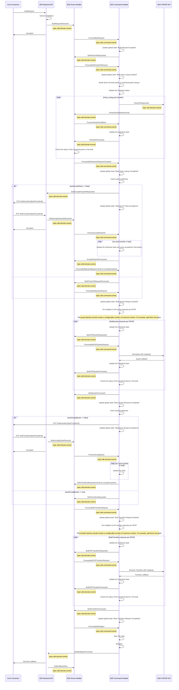

### Outbound Sequence Diagram

```mermaid
sequenceDiagram
    participant CoreConnector as Core Connector
    participant SDKOutboundAPI as SDK Backend API
    participant SDKEventHandler as SDK Event Handler
    participant SDKCommandHandler as SDK Command Handler
    participant MojaloopSwitch as SDK FSPIOP API

    CoreConnector->>+SDKOutboundAPI: BulkRequest
    SDKOutboundAPI->>SDKOutboundAPI: Scheme Validation
    SDKOutboundAPI->>SDKEventHandler: BulkRequestReceived
    Note left of SDKEventHandler: topic-sdk-domain-events
    SDKOutboundAPI->>CoreConnector: Accepted
    SDKEventHandler->>SDKCommandHandler: ProcessBulkRequest
    Note left of SDKCommandHandler: topic-sdk-command-events

    SDKCommandHandler->>SDKCommandHandler: Update global state "Bulk Request Accepted"

    SDKCommandHandler->>SDKEventHandler: BulkPartyInfoRequested
    Note right of SDKEventHandler: topic-sdk-domain-events
    SDKEventHandler->>SDKCommandHandler: ProcessBulkPartyInfoRequest
    Note left of SDKCommandHandler: topic-sdk-command-events

    SDKCommandHandler->>SDKCommandHandler: Update global state "Bulk Party Lookup Started"

    SDKCommandHandler->>SDKCommandHandler: Break down the bulk parties to individual party lookups
    SDKCommandHandler->>SDKCommandHandler: Update the individual states

    loop Party Lookup per transfer
        SDKCommandHandler->>MojaloopSwitch: PartyInfoRequested
        Note left of MojaloopSwitch: topic-sdk-domain-events
        MojaloopSwitch->>SDKEventHandler: PartyInfoCallbackReceived
        Note right of SDKEventHandler: topic-sdk-domain-events
        SDKEventHandler->>SDKCommandHandler: ProcessPartyInfoCallback
        Note left of SDKCommandHandler: topic-sdk-command-events
        SDKCommandHandler->>SDKCommandHandler: Update the individual state
        SDKCommandHandler->>SDKEventHandler: PartyInfoProcessed
        Note right of SDKEventHandler: topic-sdk-domain-events
        SDKEventHandler->>SDKEventHandler: Check the status of the remaining items in the bulk
    end
    SDKEventHandler->>SDKCommandHandler: ProcessBulkPartyInfoRequestComplete
    Note left of SDKCommandHandler: topic-sdk-command-events

    SDKCommandHandler->>SDKCommandHandler: Update global state "Bulk Party Lookup Completed"
    SDKCommandHandler->>SDKCommandHandler: check autoAcceptParty
    alt autoAcceptParty == false
        SDKCommandHandler->>SDKOutboundAPI: BulkAcceptPartyInfoRequested
        Note right of SDKOutboundAPI: topic-sdk-domain-events
        SDKOutboundAPI->>CoreConnector: PUT /bulktransfers/{bulkTransferId}
        SDKCommandHandler->>SDKCommandHandler: Update global state "Waiting For Party Acceptance"
        CoreConnector->>+SDKOutboundAPI: PUT /bulkTransfers/{bulkTransferId}
        SDKOutboundAPI->>SDKEventHandler: BulkAcceptPartyInfoReceived
        Note left of SDKEventHandler: topic-sdk-domain-events
        SDKOutboundAPI->>CoreConnector: Accepted
        SDKEventHandler->>SDKCommandHandler: ProcessAcceptPartyInfo
        Note left of SDKCommandHandler: topic-sdk-command-events
        loop for each transfer in bulk
            SDKCommandHandler->>SDKCommandHandler: Update the individual state with party acceptance information
        end
        SDKCommandHandler->>SDKEventHandler: AcceptPartyInfoProcessed
        Note right of SDKEventHandler: topic-sdk-domain-events
        SDKEventHandler->>SDKCommandHandler: ProcessBulkQuotesRequest (Only for accepted parties)
        Note left of SDKCommandHandler: topic-sdk-command-events
    else
      SDKCommandHandler->>SDKEventHandler: BulkPartyInfoRequestProcessed
      Note right of SDKEventHandler: topic-sdk-domain-events
      SDKEventHandler->>SDKCommandHandler: ProcessBulkQuotesRequest
      Note left of SDKCommandHandler: topic-sdk-command-events
    end

    SDKCommandHandler->>SDKCommandHandler: Update global state "Bulk Quotes Request Started"
    SDKCommandHandler->>SDKCommandHandler: De-multiplex to the quote requests per DFSP
    Note over SDKCommandHandler: The quote batches should contain a configurable number of maximum entries. If it exceeds, split them into parts
    loop BulkQuotes requests per DFSP
        SDKCommandHandler->>SDKCommandHandler: Update the individual state
        SDKCommandHandler->>SDKEventHandler: BulkFSPQuotesRequested
        Note right of SDKEventHandler: topic-sdk-domain-events
        SDKEventHandler->>SDKCommandHandler: ProcessBulkFSPQuotesRequest
        Note left of SDKCommandHandler: topic-sdk-command-events
        SDKCommandHandler->>MojaloopSwitch: Get Quote with mojaloop
        MojaloopSwitch->>SDKCommandHandler: Quote callback
        SDKCommandHandler->>SDKCommandHandler: Update the individual state
        SDKCommandHandler->>SDKEventHandler: BulkFSPQuotesProcessed
        Note right of SDKEventHandler: topic-sdk-domain-events
        SDKCommandHandler->>SDKCommandHandler: Check the status of the remaining items in the bulk
    end
    SDKCommandHandler->>SDKEventHandler: BulkQuotesProcessed
    Note right of SDKEventHandler: topic-sdk-domain-events
    SDKCommandHandler->>SDKCommandHandler: Update global state "Bulk Quotes Request Completed"
    SDKCommandHandler->>SDKCommandHandler: check autoAcceptQuote

    alt autoAcceptQuote == false
        SDKCommandHandler->>CoreConnector: PUT /bulktransfers/{bulkTransferId}
        SDKCommandHandler->>SDKCommandHandler: Update global state "Waiting for Quotes Acceptance"
        CoreConnector->>+SDKOutboundAPI: PUT /bulkTransfers/{bulkTransferId}
        SDKOutboundAPI->>SDKEventHandler: BulkAcceptQuoteReceived
        Note left of SDKEventHandler: topic-sdk-domain-events
        SDKOutboundAPI->>CoreConnector: Accepted

        SDKEventHandler->>SDKCommandHandler: ProcessAcceptQuote
        Note left of SDKCommandHandler: topic-sdk-domain-events

        loop for each transfer in bulk
            SDKCommandHandler->>SDKCommandHandler: Update the state
        end

        SDKCommandHandler->>SDKEventHandler: BulkTransfersRequested (Only for accepted quotes)
        Note right of SDKEventHandler: topic-sdk-domain-events

    else autoAcceptQuote == true
        SDKCommandHandler->>SDKEventHandler: BulkTransfersRequested
        Note right of SDKEventHandler: topic-sdk-domain-events
    end


    SDKEventHandler->>SDKCommandHandler: ProcessBulkTransfersRequest
    Note left of SDKCommandHandler: topic-sdk-command-events
    SDKCommandHandler->>SDKCommandHandler: Update global state "Bulk Transfers Request Started"
    SDKCommandHandler->>SDKCommandHandler: De-multiplex to the transfer requests per DFSP
    Note over SDKCommandHandler: The transfer batches should contain a configurable number of maximum entries. If it exceeds, split them into parts

    loop BulkTransfers requests per DFSP
        SDKCommandHandler->>SDKCommandHandler: Update the individual state
        SDKCommandHandler->>SDKEventHandler: BulkFSPTransfersRequested
        Note right of SDKEventHandler: topic-sdk-domain-events
        SDKEventHandler->>SDKCommandHandler: ProcessBulkFSPTransfersRequest
        Note left of SDKCommandHandler: topic-sdk-command-events
        SDKCommandHandler->>MojaloopSwitch: Execute Transfers with mojaloop
        MojaloopSwitch->>SDKCommandHandler: Transfers callback
        SDKCommandHandler->>SDKCommandHandler: Update the individual state
        SDKCommandHandler->>SDKEventHandler: BulkFSPTransfersProcessed
        Note right of SDKEventHandler: topic-sdk-domain-events
        SDKCommandHandler->>SDKCommandHandler: Check the status of the remaining items in the bulk
    end

    SDKCommandHandler->>SDKEventHandler: BulkTransfersProcessed
    Note right of SDKEventHandler: topic-sdk-domain-events
    SDKCommandHandler->>SDKCommandHandler: Update global state "Bulk Transfers Request Completed"

    SDKEventHandler->>SDKCommandHandler: ProcessBulkMultiplex
    Note left of SDKCommandHandler: topic-sdk-command-events
    SDKCommandHandler->>SDKCommandHandler: Save the state
    SDKCommandHandler->>SDKCommandHandler: Multiplex
    SDKCommandHandler->>SDKOutboundAPI: BulkMultiplexProcessed
    Note right of SDKOutboundAPI: topic-sdk-domain-events
    SDKOutboundAPI->>CoreConnector: Send the callback
    SDKOutboundAPI->>SDKEventHandler: BulkCallbackSent
    Note left of SDKEventHandler: topic-sdk-domain-events

```
