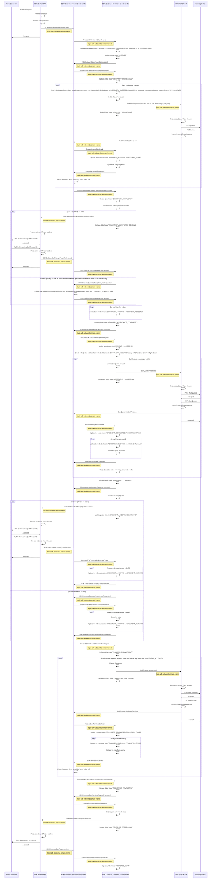

### Outbound Sequence Diagram

```mermaid
sequenceDiagram
    participant CoreConnector as Core Connector
    participant SDKOutboundAPI as SDK Backend API
    participant SDKOutboundDomainEventHandler as SDK Outbound Domain Event Handler
    participant SDKOutboundCommandEventHandler as SDK Outbound Command Event Handler
    participant SDKFspiopApi as SDK FSPIOP API
    participant MojaloopSwitch as Mojaloop Switch

    CoreConnector->>+SDKOutboundAPI: SDKBulkRequest
    SDKOutboundAPI->>SDKOutboundAPI: Scheme Validation
    SDKOutboundAPI->>SDKOutboundAPI: Process Trace Headers
    SDKOutboundAPI->>SDKOutboundDomainEventHandler: SDKOutboundBulkRequestReceived
    Note left of SDKOutboundDomainEventHandler: topic-sdk-outbound-domain-events
    SDKOutboundAPI->>CoreConnector: Accepted
    SDKOutboundDomainEventHandler->>SDKOutboundCommandEventHandler: ProcessSDKOutboundBulkRequest
    Note left of SDKOutboundCommandEventHandler: topic-sdk-outbound-command-events

    SDKOutboundCommandEventHandler->>SDKOutboundCommandEventHandler: Store initial data into redis (Generate UUIDs and map to persistent model, break the JSON into smaller parts)
    SDKOutboundCommandEventHandler->>SDKOutboundCommandEventHandler: Update global state "RECEIVED"

    SDKOutboundCommandEventHandler->>SDKOutboundDomainEventHandler: SDKOutboundBulkPartyInfoRequested
    Note right of SDKOutboundDomainEventHandler: topic-sdk-outbound-domain-events
    SDKOutboundDomainEventHandler->>SDKOutboundCommandEventHandler: ProcessSDKOutboundBulkPartyInfoRequest
    Note left of SDKOutboundCommandEventHandler: topic-sdk-outbound-command-events

    SDKOutboundCommandEventHandler->>SDKOutboundCommandEventHandler: Update global state "DISCOVERY_PROCESSING"


    loop Party Lookup per transfer
        SDKOutboundCommandEventHandler->>SDKOutboundCommandEventHandler: Read individual attributes, if the party info already exists then change the individual state to DISCOVERY_SUCCESS else publish the individual event and update the state to DISCOVERY_RECEIVED
        SDKOutboundCommandEventHandler->>SDKOutboundCommandEventHandler: Update the party request
        SDKOutboundCommandEventHandler->>SDKFspiopApi: PartyInfoRequested (includes info for SDK for making a party call)
        Note left of SDKFspiopApi: topic-sdk-outbound-domain-events
        SDKOutboundCommandEventHandler->>SDKOutboundCommandEventHandler: Set individual state: DISCOVERY_PROCESSING
        SDKFspiopApi->>SDKFspiopApi: Process outbound Trace Headers
        SDKFspiopApi->>MojaloopSwitch: GET /parties
        MojaloopSwitch->>SDKFspiopApi: PUT /parties
        SDKFspiopApi->>SDKFspiopApi: Process Inbound Trace Headers
        SDKFspiopApi->>SDKOutboundDomainEventHandler: PartyInfoCallbackReceived
        Note right of SDKOutboundDomainEventHandler: topic-sdk-outbound-domain-events
        SDKOutboundDomainEventHandler->>SDKOutboundCommandEventHandler: ProcessPartyInfoCallback
        Note left of SDKOutboundCommandEventHandler: topic-sdk-outbound-command-events
        SDKOutboundCommandEventHandler->>SDKOutboundCommandEventHandler: Update the individual state: DISCOVERY_SUCCESS / DISCOVERY_FAILED
        SDKOutboundCommandEventHandler->>SDKOutboundCommandEventHandler: Update the party response
        SDKOutboundCommandEventHandler->>SDKOutboundDomainEventHandler: PartyInfoCallbackProcessed
        Note right of SDKOutboundDomainEventHandler: topic-sdk-outbound-domain-events
        SDKOutboundDomainEventHandler->>SDKOutboundDomainEventHandler: Check the status of the remaining items in the bulk
    end
    SDKOutboundDomainEventHandler->>SDKOutboundCommandEventHandler: ProcessSDKOutboundBulkPartyInfoRequestComplete
    Note left of SDKOutboundCommandEventHandler: topic-sdk-outbound-command-events

    SDKOutboundCommandEventHandler->>SDKOutboundCommandEventHandler: Update global state "DISCOVERY_COMPLETED"
    SDKOutboundCommandEventHandler->>SDKOutboundCommandEventHandler: check optiions.autoAcceptParty in redis

    alt autoAcceptParty == false
        SDKOutboundCommandEventHandler->>SDKOutboundAPI: SDKOutboundBulkAcceptPartyInfoRequested
        Note right of SDKOutboundAPI: topic-sdk-outbound-domain-events
        SDKOutboundCommandEventHandler->>SDKOutboundCommandEventHandler: Update global state "DISCOVERY_ACCEPTANCE_PENDING"
        SDKOutboundAPI->>SDKOutboundAPI: Process outbound Trace Headers
        SDKOutboundAPI->>CoreConnector: PUT /bulktransfers/{bulkTransferId}
        CoreConnector-->>SDKOutboundAPI: Accepted
        CoreConnector->>+SDKOutboundAPI: PUT /bulkTransfers/{bulkTransferId}
        SDKOutboundAPI->>SDKOutboundAPI: Process inbound Trace Headers
        SDKOutboundAPI->>SDKOutboundDomainEventHandler: SDKOutboundBulkAcceptPartyInfoReceived
        Note left of SDKOutboundDomainEventHandler: topic-sdk-outbound-domain-events
        SDKOutboundAPI-->>CoreConnector: Accepted
        SDKOutboundDomainEventHandler->>SDKOutboundCommandEventHandler: ProcessSDKOutboundBulkAcceptPartyInfo
        Note left of SDKOutboundCommandEventHandler: topic-sdk-outbound-command-events

    else autoAcceptParty == true (In future we can make this optional and an external service can handle this)
        SDKOutboundCommandEventHandler->>SDKOutboundDomainEventHandler: SDKOutboundBulkAutoAcceptPartyInfoRequested
        Note right of SDKOutboundDomainEventHandler: topic-sdk-outbound-domain-events
        SDKOutboundDomainEventHandler->>SDKOutboundDomainEventHandler: Create SDKOutboundBulkAcceptPartyInfo with acceptParty=true for individual items with DISCOVERY_SUCCESS state
        SDKOutboundDomainEventHandler->>SDKOutboundCommandEventHandler: ProcessSDKOutboundBulkAcceptPartyInfo
        Note left of SDKOutboundCommandEventHandler: topic-sdk-outbound-command-events
    end

    loop for each transfer in bulk
        SDKOutboundCommandEventHandler->>SDKOutboundCommandEventHandler: Update the individual state: DISCOVERY_ACCEPTED / DISCOVERY_REJECTED
    end
    SDKOutboundCommandEventHandler->>SDKOutboundCommandEventHandler: Update global state "DISCOVERY_ACCEPTANCE_COMPLETED"
    SDKOutboundCommandEventHandler->>SDKOutboundDomainEventHandler: SDKOutboundBulkAcceptPartyInfoProcessed
    Note right of SDKOutboundDomainEventHandler: topic-sdk-outbound-domain-events
    SDKOutboundDomainEventHandler->>SDKOutboundCommandEventHandler: ProcessSDKOutboundBulkQuotesRequest
    Note left of SDKOutboundCommandEventHandler: topic-sdk-outbound-command-events

    SDKOutboundCommandEventHandler->>SDKOutboundCommandEventHandler: Update global state "AGREEMENT_PROCESSING"
    SDKOutboundCommandEventHandler->>SDKOutboundCommandEventHandler: Create bulkQuotes batches from individual items with DISCOVERY_ACCEPTED state per FSP and maxEntryConfigPerBatch
    loop BulkQuotes requests per batch
        SDKOutboundCommandEventHandler->>SDKOutboundCommandEventHandler: Update bulkQuotes request
        SDKOutboundCommandEventHandler->>SDKFspiopApi: BulkQuotesRequested
        Note left of SDKFspiopApi: topic-sdk-outbound-domain-events
        SDKOutboundCommandEventHandler->>SDKOutboundCommandEventHandler: Update the batch state: AGREEMENT_PROCESSING
        SDKFspiopApi->>SDKFspiopApi: Process outbound Trace Headers
        SDKFspiopApi->>MojaloopSwitch: POST /bulkQuotes
        MojaloopSwitch-->>SDKFspiopApi: Accepted
        MojaloopSwitch->>SDKFspiopApi: PUT /bulkQuotes
        SDKFspiopApi->>SDKFspiopApi: Process inbound Trace Headers
        SDKFspiopApi->>SDKOutboundDomainEventHandler: BulkQuotesCallbackReceived
        Note right of SDKOutboundDomainEventHandler: topic-sdk-outbound-domain-events
        SDKFspiopApi-->>MojaloopSwitch: Accepted
        SDKOutboundDomainEventHandler->>SDKOutboundCommandEventHandler: ProcessBulkQuotesCallback
        Note left of SDKOutboundCommandEventHandler: topic-sdk-outbound-command-events
        SDKOutboundCommandEventHandler->>SDKOutboundCommandEventHandler: Update the batch state: AGREEMENT_COMPLETED / AGREEMENT_FAILED
        loop through items in batch
          SDKOutboundCommandEventHandler->>SDKOutboundCommandEventHandler: Update the individual state: AGREEMENT_SUCCESS / AGREEMENT_FAILED
          SDKOutboundCommandEventHandler->>SDKOutboundCommandEventHandler: Update the quote response
        end
        SDKOutboundCommandEventHandler->>SDKOutboundDomainEventHandler: BulkQuotesCallbackProcessed
        Note right of SDKOutboundDomainEventHandler: topic-sdk-outbound-domain-events
        SDKOutboundCommandEventHandler->>SDKOutboundCommandEventHandler: Check the status of the remaining items in the bulk
    end

    SDKOutboundCommandEventHandler->>SDKOutboundCommandEventHandler: Update global state "AGREEMENT_COMPLETED"
    SDKOutboundCommandEventHandler->>SDKOutboundDomainEventHandler: SDKOutboundBulkQuotesRequestProcessed
    Note right of SDKOutboundDomainEventHandler: topic-sdk-outbound-domain-events

    SDKOutboundCommandEventHandler->>SDKOutboundCommandEventHandler: check autoAcceptQuote

    alt autoAcceptQuote == false
        SDKOutboundCommandEventHandler->>SDKOutboundAPI: SDKOutboundBulkAcceptQuoteRequested
        Note right of SDKOutboundAPI: topic-sdk-outbound-domain-events
        SDKOutboundCommandEventHandler->>SDKOutboundCommandEventHandler: Update global state "AGREEMENT_ACCEPTANCE_PENDING"
        SDKOutboundAPI->>SDKOutboundAPI: Process outbound Trace Headers
        SDKOutboundAPI->>CoreConnector: PUT /bulktransfers/{bulkTransferId}
        CoreConnector-->>SDKOutboundAPI: Accepted

        CoreConnector->>+SDKOutboundAPI: PUT /bulkTransfers/{bulkTransferId}
        SDKOutboundAPI->>SDKOutboundAPI: Process inbound Trace Headers
        SDKOutboundAPI->>SDKOutboundDomainEventHandler: SDKOutboundBulkAcceptQuoteReceived
        Note left of SDKOutboundDomainEventHandler: topic-sdk-outbound-domain-events
        SDKOutboundAPI-->>CoreConnector: Accepted
        SDKOutboundDomainEventHandler->>SDKOutboundCommandEventHandler: ProcessSDKOutboundBulkAcceptQuote
        Note left of SDKOutboundCommandEventHandler: topic-sdk-outbound-command-events
        loop for each individual transfer in bulk
            SDKOutboundCommandEventHandler->>SDKOutboundCommandEventHandler: Update the individual state: AGREEMENT_ACCEPTED / AGREEMENT_REJECTED
        end
        SDKOutboundCommandEventHandler->>SDKOutboundDomainEventHandler: SDKOutboundBulkAcceptQuoteProcessed
        Note right of SDKOutboundDomainEventHandler: topic-sdk-outbound-domain-events
    else autoAcceptQuote == true
        SDKOutboundCommandEventHandler->>SDKOutboundDomainEventHandler: SDKOutboundBulkAutoAcceptQuoteRequested
        Note right of SDKOutboundDomainEventHandler: topic-sdk-outbound-domain-events
        SDKOutboundDomainEventHandler->>SDKOutboundCommandEventHandler: ProcessSDKOutboundBulkAutoAcceptQuote
        Note left of SDKOutboundCommandEventHandler: topic-sdk-outbound-command-events
        loop for each individual transfer in bulk
            SDKOutboundCommandEventHandler->>SDKOutboundCommandEventHandler: Check fee limits
            SDKOutboundCommandEventHandler->>SDKOutboundCommandEventHandler: Update the individual state: AGREEMENT_ACCEPTED / AGREEMENT_REJECTED
        end
        SDKOutboundCommandEventHandler->>SDKOutboundDomainEventHandler: SDKOutboundBulkAutoAcceptQuoteCompleted
        Note right of SDKOutboundDomainEventHandler: topic-sdk-outbound-domain-events
    end
    SDKOutboundDomainEventHandler->>SDKOutboundCommandEventHandler: ProcessSDKOutboundBulkTransfersRequest
    Note left of SDKOutboundCommandEventHandler: topic-sdk-outbound-command-events

    SDKOutboundCommandEventHandler->>SDKOutboundCommandEventHandler: Update global state "TRANSFERS_PROCESSING"

    loop BulkTransfers requests per each batch and include only items with AGREEMENT_ACCEPTED
        SDKOutboundCommandEventHandler->>SDKOutboundCommandEventHandler: Update the request
        SDKOutboundCommandEventHandler->>SDKFspiopApi: BulkTransfersRequested
        Note left of SDKFspiopApi: topic-sdk-outbound-domain-events
        SDKOutboundCommandEventHandler->>SDKOutboundCommandEventHandler: Update the batch state: TRANSFERS_PROCESSING
        SDKFspiopApi->>SDKFspiopApi: Process outbound Trace Headers
        SDKFspiopApi->>MojaloopSwitch: POST /bulkTransfers
        MojaloopSwitch-->>SDKFspiopApi: Accepted
        MojaloopSwitch->>SDKFspiopApi: PUT /bulkTransfers
        SDKFspiopApi->>SDKFspiopApi: Process inbound Trace Headers
        SDKFspiopApi->>SDKOutboundDomainEventHandler: BulkTransfersCallbackReceived
        Note right of SDKOutboundDomainEventHandler: topic-sdk-outbound-domain-events
        SDKFspiopApi-->>MojaloopSwitch: Accepted
        SDKOutboundDomainEventHandler->>SDKOutboundCommandEventHandler: ProcessBulkTransfersCallback
        Note left of SDKOutboundCommandEventHandler: topic-sdk-outbound-command-events
        SDKOutboundCommandEventHandler->>SDKOutboundCommandEventHandler: Update the batch state: TRANSFERS_COMPLETED / TRANSFERS_FAILED
        loop through items in batch
          SDKOutboundCommandEventHandler->>SDKOutboundCommandEventHandler: Update the individual state: TRANSFERS_SUCCESS / TRANSFERS_FAILED
          SDKOutboundCommandEventHandler->>SDKOutboundCommandEventHandler: Update the transfer response
        end
        SDKOutboundCommandEventHandler->>SDKOutboundDomainEventHandler: BulkTransfersProcessed
        Note right of SDKOutboundDomainEventHandler: topic-sdk-outbound-domain-events
        SDKOutboundDomainEventHandler->>SDKOutboundDomainEventHandler: Check the status of the remaining items in the bulk
    end
    SDKOutboundDomainEventHandler->>SDKOutboundCommandEventHandler: ProcessSDKOutboundBulkTransfersRequestComplete
    Note left of SDKOutboundCommandEventHandler: topic-sdk-outbound-command-events
    SDKOutboundCommandEventHandler->>SDKOutboundCommandEventHandler: Update global state "TRANSFERS_COMPLETED"

    SDKOutboundCommandEventHandler->>SDKOutboundDomainEventHandler: SDKOutboundBulkTransfersRequestProcessed
    Note right of SDKOutboundDomainEventHandler: topic-sdk-outbound-domain-events

    SDKOutboundDomainEventHandler->>SDKOutboundCommandEventHandler: PrepareSDKOutboundBulkResponse
    Note left of SDKOutboundCommandEventHandler: topic-sdk-outbound-command-events
    SDKOutboundCommandEventHandler->>SDKOutboundCommandEventHandler: Build response from redis state
    SDKOutboundCommandEventHandler->>SDKOutboundAPI: SDKOutboundBulkResponsePrepared
    Note right of SDKOutboundAPI: topic-sdk-outbound-domain-events
    SDKOutboundCommandEventHandler->>SDKOutboundCommandEventHandler: Update global state "RESPONSE_PROCESSING"
    SDKOutboundAPI->>SDKOutboundAPI: Process outbound Trace Headers
    SDKOutboundAPI->>CoreConnector: Send the response as callback
    CoreConnector-->>SDKOutboundAPI: Accepted
    SDKOutboundAPI->>SDKOutboundDomainEventHandler: SDKOutboundBulkResponseSent
    Note left of SDKOutboundDomainEventHandler: topic-sdk-outbound-domain-events
    SDKOutboundDomainEventHandler->>SDKOutboundCommandEventHandler: ProcessSDKOutboundBulkResponseSent
    Note left of SDKOutboundCommandEventHandler: topic-sdk-outbound-command-events
    SDKOutboundCommandEventHandler->>SDKOutboundCommandEventHandler: Update global state "RESPONSE_SENT"

```
