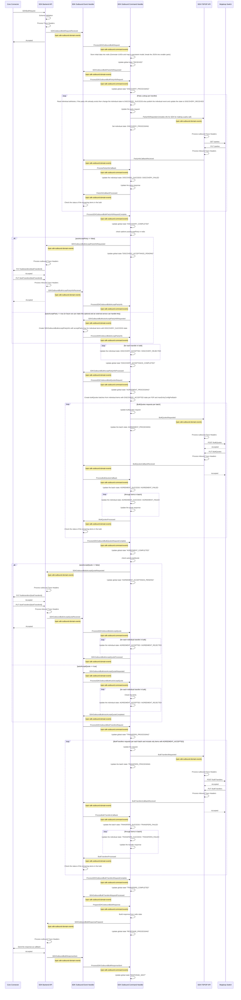

### Outbound Sequence Diagram

```mermaid
sequenceDiagram
    participant CoreConnector as Core Connector
    participant SDKOutboundAPI as SDK Backend API
    participant SDKOutboundEventHandler as SDK Outbound Event Handler
    participant SDKOutboundCommandHandler as SDK Outbound Command Handler
    participant SDKFspiopApi as SDK FSPIOP API
    participant MojaloopSwitch as Mojaloop Switch

    CoreConnector->>+SDKOutboundAPI: SDKBulkRequest
    SDKOutboundAPI->>SDKOutboundAPI: Scheme Validation
    SDKOutboundAPI->>SDKOutboundAPI: Process Trace Headers
    SDKOutboundAPI->>SDKOutboundEventHandler: SDKOutboundBulkRequestReceived
    Note left of SDKOutboundEventHandler: topic-sdk-outbound-domain-events
    SDKOutboundAPI->>CoreConnector: Accepted
    SDKOutboundEventHandler->>SDKOutboundCommandHandler: ProcessSDKOutboundBulkRequest
    Note left of SDKOutboundCommandHandler: topic-sdk-outbound-command-events

    SDKOutboundCommandHandler->>SDKOutboundCommandHandler: Store initial data into redis (Generate UUIDs and map to persistent model, break the JSON into smaller parts)
    SDKOutboundCommandHandler->>SDKOutboundCommandHandler: Update global state "RECEIVED"

    SDKOutboundCommandHandler->>SDKOutboundEventHandler: SDKOutboundBulkPartyInfoRequested
    Note right of SDKOutboundEventHandler: topic-sdk-outbound-domain-events
    SDKOutboundEventHandler->>SDKOutboundCommandHandler: ProcessSDKOutboundBulkPartyInfoRequest
    Note left of SDKOutboundCommandHandler: topic-sdk-outbound-command-events

    SDKOutboundCommandHandler->>SDKOutboundCommandHandler: Update global state "DISCOVERY_PROCESSING"


    loop Party Lookup per transfer
        SDKOutboundCommandHandler->>SDKOutboundCommandHandler: Read individual attributes, if the party info already exists then change the individual state to DISCOVERY_SUCCESS else publish the individual event and update the state to DISCOVERY_RECEIVED
        SDKOutboundCommandHandler->>SDKOutboundCommandHandler: Update the party request
        SDKOutboundCommandHandler->>SDKFspiopApi: PartyInfoRequested (includes info for SDK for making a party call)
        Note left of SDKFspiopApi: topic-sdk-outbound-domain-events
        SDKOutboundCommandHandler->>SDKOutboundCommandHandler: Set individual state: DISCOVERY_PROCESSING
        SDKFspiopApi->>SDKFspiopApi: Process outbound Trace Headers
        SDKFspiopApi->>MojaloopSwitch: GET /parties
        MojaloopSwitch->>SDKFspiopApi: PUT /parties
        SDKFspiopApi->>SDKFspiopApi: Process Inbound Trace Headers
        SDKFspiopApi->>SDKOutboundEventHandler: PartyInfoCallbackReceived
        Note right of SDKOutboundEventHandler: topic-sdk-outbound-domain-events
        SDKOutboundEventHandler->>SDKOutboundCommandHandler: ProcessPartyInfoCallback
        Note left of SDKOutboundCommandHandler: topic-sdk-outbound-command-events
        SDKOutboundCommandHandler->>SDKOutboundCommandHandler: Update the individual state: DISCOVERY_SUCCESS / DISCOVERY_FAILED
        SDKOutboundCommandHandler->>SDKOutboundCommandHandler: Update the party response
        SDKOutboundCommandHandler->>SDKOutboundEventHandler: PartyInfoCallbackProcessed
        Note right of SDKOutboundEventHandler: topic-sdk-outbound-domain-events
        SDKOutboundEventHandler->>SDKOutboundEventHandler: Check the status of the remaining items in the bulk
    end
    SDKOutboundEventHandler->>SDKOutboundCommandHandler: ProcessSDKOutboundBulkPartyInfoRequestComplete
    Note left of SDKOutboundCommandHandler: topic-sdk-outbound-command-events

    SDKOutboundCommandHandler->>SDKOutboundCommandHandler: Update global state "DISCOVERY_COMPLETED"
    SDKOutboundCommandHandler->>SDKOutboundCommandHandler: check optiions.autoAcceptParty in redis

    alt autoAcceptParty == false
        SDKOutboundCommandHandler->>SDKOutboundAPI: SDKOutboundBulkAcceptPartyInfoRequested
        Note right of SDKOutboundAPI: topic-sdk-outbound-domain-events
        SDKOutboundCommandHandler->>SDKOutboundCommandHandler: Update global state "DISCOVERY_ACCEPTANCE_PENDING"
        SDKOutboundAPI->>SDKOutboundAPI: Process outbound Trace Headers
        SDKOutboundAPI->>CoreConnector: PUT /bulktransfers/{bulkTransferId}
        CoreConnector-->>SDKOutboundAPI: Accepted
        CoreConnector->>+SDKOutboundAPI: PUT /bulkTransfers/{bulkTransferId}
        SDKOutboundAPI->>SDKOutboundAPI: Process inbound Trace Headers
        SDKOutboundAPI->>SDKOutboundEventHandler: SDKOutboundBulkAcceptPartyInfoReceived
        Note left of SDKOutboundEventHandler: topic-sdk-outbound-domain-events
        SDKOutboundAPI-->>CoreConnector: Accepted
        SDKOutboundEventHandler->>SDKOutboundCommandHandler: ProcessSDKOutboundBulkAcceptPartyInfo
        Note left of SDKOutboundCommandHandler: topic-sdk-outbound-command-events

    else autoAcceptParty == true (In future we can make this optional and an external service can handle this)
        SDKOutboundCommandHandler->>SDKOutboundEventHandler: SDKOutboundBulkAutoAcceptPartyInfoRequested
        Note right of SDKOutboundEventHandler: topic-sdk-outbound-domain-events
        SDKOutboundEventHandler->>SDKOutboundEventHandler: Create SDKOutboundBulkAcceptPartyInfo with acceptParty=true for individual items with DISCOVERY_SUCCESS state
        SDKOutboundEventHandler->>SDKOutboundCommandHandler: ProcessSDKOutboundBulkAcceptPartyInfo
        Note left of SDKOutboundCommandHandler: topic-sdk-outbound-command-events
    end

    loop for each transfer in bulk
        SDKOutboundCommandHandler->>SDKOutboundCommandHandler: Update the individual state: DISCOVERY_ACCEPTED / DISCOVERY_REJECTED
    end
    SDKOutboundCommandHandler->>SDKOutboundCommandHandler: Update global state "DISCOVERY_ACCEPTANCE_COMPLETED"
    SDKOutboundCommandHandler->>SDKOutboundEventHandler: SDKOutboundBulkAcceptPartyInfoProcessed
    Note right of SDKOutboundEventHandler: topic-sdk-outbound-domain-events
    SDKOutboundEventHandler->>SDKOutboundCommandHandler: ProcessSDKOutboundBulkQuotesRequest
    Note left of SDKOutboundCommandHandler: topic-sdk-outbound-command-events

    SDKOutboundCommandHandler->>SDKOutboundCommandHandler: Update global state "AGREEMENT_PROCESSING"
    SDKOutboundCommandHandler->>SDKOutboundCommandHandler: Create bulkQuotes batches from individual items with DISCOVERY_ACCEPTED state per FSP and maxEntryConfigPerBatch
    loop BulkQuotes requests per batch
        SDKOutboundCommandHandler->>SDKOutboundCommandHandler: Update bulkQuotes request
        SDKOutboundCommandHandler->>SDKFspiopApi: BulkQuotesRequested
        Note left of SDKFspiopApi: topic-sdk-outbound-domain-events
        SDKOutboundCommandHandler->>SDKOutboundCommandHandler: Update the batch state: AGREEMENT_PROCESSING
        SDKFspiopApi->>SDKFspiopApi: Process outbound Trace Headers
        SDKFspiopApi->>MojaloopSwitch: POST /bulkQuotes
        MojaloopSwitch-->>SDKFspiopApi: Accepted
        MojaloopSwitch->>SDKFspiopApi: PUT /bulkQuotes
        SDKFspiopApi->>SDKFspiopApi: Process inbound Trace Headers
        SDKFspiopApi->>SDKOutboundEventHandler: BulkQuotesCallbackReceived
        Note right of SDKOutboundEventHandler: topic-sdk-outbound-domain-events
        SDKFspiopApi-->>MojaloopSwitch: Accepted
        SDKOutboundEventHandler->>SDKOutboundCommandHandler: ProcessBulkQuotesCallback
        Note left of SDKOutboundCommandHandler: topic-sdk-outbound-command-events
        SDKOutboundCommandHandler->>SDKOutboundCommandHandler: Update the batch state: AGREEMENT_SUCCESS / AGREEMENT_FAILED
        loop through items in batch
          SDKOutboundCommandHandler->>SDKOutboundCommandHandler: Update the individual state: AGREEMENT_SUCCESS / AGREEMENT_FAILED
          SDKOutboundCommandHandler->>SDKOutboundCommandHandler: Update the quote response
        end
        SDKOutboundCommandHandler->>SDKOutboundEventHandler: BulkQuotesProcessed
        Note right of SDKOutboundEventHandler: topic-sdk-outbound-domain-events
        SDKOutboundEventHandler->>SDKOutboundEventHandler: Check the status of the remaining items in the bulk
    end
    SDKOutboundEventHandler->>SDKOutboundCommandHandler: ProcessSDKOutboundBulkQuotesRequestComplete
    Note left of SDKOutboundCommandHandler: topic-sdk-outbound-command-events

    SDKOutboundCommandHandler->>SDKOutboundCommandHandler: Update global state "AGREEMENT_COMPLETED"
    SDKOutboundCommandHandler->>SDKOutboundCommandHandler: check autoAcceptQuote

    alt autoAcceptQuote == false
        SDKOutboundCommandHandler->>SDKOutboundAPI: SDKOutboundBulkAcceptQuoteRequested
        Note right of SDKOutboundAPI: topic-sdk-outbound-domain-events
        SDKOutboundCommandHandler->>SDKOutboundCommandHandler: Update global state "AGREEMENT_ACCEPTANCE_PENDING"
        SDKOutboundAPI->>SDKOutboundAPI: Process outbound Trace Headers
        SDKOutboundAPI->>CoreConnector: PUT /bulktransfers/{bulkTransferId}
        CoreConnector-->>SDKOutboundAPI: Accepted

        CoreConnector->>+SDKOutboundAPI: PUT /bulkTransfers/{bulkTransferId}
        SDKOutboundAPI->>SDKOutboundAPI: Process inbound Trace Headers
        SDKOutboundAPI->>SDKOutboundEventHandler: SDKOutboundBulkAcceptQuoteReceived
        Note left of SDKOutboundEventHandler: topic-sdk-outbound-domain-events
        SDKOutboundAPI-->>CoreConnector: Accepted
        SDKOutboundEventHandler->>SDKOutboundCommandHandler: ProcessSDKOutboundBulkAcceptQuote
        Note left of SDKOutboundCommandHandler: topic-sdk-outbound-command-events
        loop for each individual transfer in bulk
            SDKOutboundCommandHandler->>SDKOutboundCommandHandler: Update the individual state: AGREEMENT_ACCEPTED / AGREEMENT_REJECTED
        end
        SDKOutboundCommandHandler->>SDKOutboundEventHandler: SDKOutboundBulkAcceptQuoteProcessed
        Note right of SDKOutboundEventHandler: topic-sdk-outbound-domain-events
    else autoAcceptQuote == true
        SDKOutboundCommandHandler->>SDKOutboundEventHandler: SDKOutboundBulkAutoAcceptQuoteRequested
        Note right of SDKOutboundEventHandler: topic-sdk-outbound-domain-events
        SDKOutboundEventHandler->>SDKOutboundCommandHandler: ProcessSDKOutboundBulkAutoAcceptQuote
        Note left of SDKOutboundCommandHandler: topic-sdk-outbound-command-events
        loop for each individual transfer in bulk
            SDKOutboundCommandHandler->>SDKOutboundCommandHandler: Check fee limits
            SDKOutboundCommandHandler->>SDKOutboundCommandHandler: Update the individual state: AGREEMENT_ACCEPTED / AGREEMENT_REJECTED
        end
        SDKOutboundCommandHandler->>SDKOutboundEventHandler: SDKOutboundBulkAutoAcceptQuoteCompleted
        Note right of SDKOutboundEventHandler: topic-sdk-outbound-domain-events
    end
    SDKOutboundEventHandler->>SDKOutboundCommandHandler: ProcessSDKOutboundBulkTransfersRequest
    Note left of SDKOutboundCommandHandler: topic-sdk-outbound-command-events

    SDKOutboundCommandHandler->>SDKOutboundCommandHandler: Update global state "TRANSFERS_PROCESSING"

    loop BulkTransfers requests per each batch and include only items with AGREEMENT_ACCEPTED
        SDKOutboundCommandHandler->>SDKOutboundCommandHandler: Update the request
        SDKOutboundCommandHandler->>SDKFspiopApi: BulkTransfersRequested
        Note left of SDKFspiopApi: topic-sdk-outbound-domain-events
        SDKOutboundCommandHandler->>SDKOutboundCommandHandler: Update the batch state: TRANSFERS_PROCESSING
        SDKFspiopApi->>SDKFspiopApi: Process outbound Trace Headers
        SDKFspiopApi->>MojaloopSwitch: POST /bulkTransfers
        MojaloopSwitch-->>SDKFspiopApi: Accepted
        MojaloopSwitch->>SDKFspiopApi: PUT /bulkTransfers
        SDKFspiopApi->>SDKFspiopApi: Process inbound Trace Headers
        SDKFspiopApi->>SDKOutboundEventHandler: BulkTransfersCallbackReceived
        Note right of SDKOutboundEventHandler: topic-sdk-outbound-domain-events
        SDKFspiopApi-->>MojaloopSwitch: Accepted
        SDKOutboundEventHandler->>SDKOutboundCommandHandler: ProcessBulkTransfersCallback
        Note left of SDKOutboundCommandHandler: topic-sdk-outbound-command-events
        SDKOutboundCommandHandler->>SDKOutboundCommandHandler: Update the batch state: TRANSFERS_SUCCESS / TRANSFERS_FAILED
        loop through items in batch
          SDKOutboundCommandHandler->>SDKOutboundCommandHandler: Update the individual state: TRANSFERS_SUCCESS / TRANSFERS_FAILED
          SDKOutboundCommandHandler->>SDKOutboundCommandHandler: Update the transfer response
        end
        SDKOutboundCommandHandler->>SDKOutboundEventHandler: BulkTransfersProcessed
        Note right of SDKOutboundEventHandler: topic-sdk-outbound-domain-events
        SDKOutboundEventHandler->>SDKOutboundEventHandler: Check the status of the remaining items in the bulk
    end
    SDKOutboundEventHandler->>SDKOutboundCommandHandler: ProcessSDKOutboundBulkTransfersRequestComplete
    Note left of SDKOutboundCommandHandler: topic-sdk-outbound-command-events
    SDKOutboundCommandHandler->>SDKOutboundCommandHandler: Update global state "TRANSFERS_COMPLETED"

    SDKOutboundCommandHandler->>SDKOutboundEventHandler: SDKOutboundBulkTransfersRequestProcessed
    Note right of SDKOutboundEventHandler: topic-sdk-outbound-domain-events

    SDKOutboundEventHandler->>SDKOutboundCommandHandler: PrepareSDKOutboundBulkResponse
    Note left of SDKOutboundCommandHandler: topic-sdk-outbound-command-events
    SDKOutboundCommandHandler->>SDKOutboundCommandHandler: Build response from redis state
    SDKOutboundCommandHandler->>SDKOutboundAPI: SDKOutboundBulkResponsePrepared
    Note right of SDKOutboundAPI: topic-sdk-outbound-domain-events
    SDKOutboundCommandHandler->>SDKOutboundCommandHandler: Update global state "RESPONSE_PROCESSING"
    SDKOutboundAPI->>SDKOutboundAPI: Process outbound Trace Headers
    SDKOutboundAPI->>CoreConnector: Send the response as callback
    CoreConnector-->>SDKOutboundAPI: Accepted
    SDKOutboundAPI->>SDKOutboundEventHandler: SDKOutboundBulkResponseSent
    Note left of SDKOutboundEventHandler: topic-sdk-outbound-domain-events
    SDKOutboundEventHandler->>SDKOutboundCommandHandler: ProcessSDKOutboundBulkResponseSent
    Note left of SDKOutboundCommandHandler: topic-sdk-outbound-command-events
    SDKOutboundCommandHandler->>SDKOutboundCommandHandler: Update global state "RESPONSE_SENT"

```
