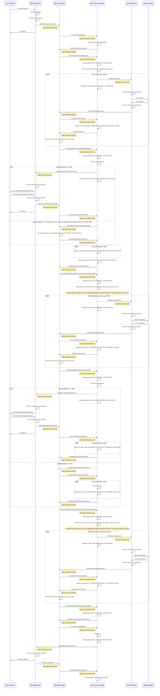

### Outbound Sequence Diagram

```mermaid
sequenceDiagram
    participant CoreConnector as Core Connector
    participant SDKOutboundAPI as SDK Backend API
    participant SDKEventHandler as SDK Event Handler
    participant SDKCommandHandler as SDK Command Handler
    participant SDKFspiopApi as SDK FSPIOP API
    participant MojaloopSwitch as Mojaloop Switch

    CoreConnector->>+SDKOutboundAPI: SDKBulkRequest
    SDKOutboundAPI->>SDKOutboundAPI: Scheme Validation
    SDKOutboundAPI->>SDKOutboundAPI: Process Trace Headers
    SDKOutboundAPI->>SDKEventHandler: SDKBulkRequestReceived
    Note left of SDKEventHandler: topic-sdk-domain-events
    SDKOutboundAPI->>CoreConnector: Accepted
    SDKEventHandler->>SDKCommandHandler: ProcessSDKBulkRequest
    Note left of SDKCommandHandler: topic-sdk-command-events

    SDKCommandHandler->>SDKCommandHandler: Update global state "RECEIVED"

    SDKCommandHandler->>SDKEventHandler: SDKBulkPartyInfoRequested
    Note right of SDKEventHandler: topic-sdk-domain-events
    SDKEventHandler->>SDKCommandHandler: ProcessSDKBulkPartyInfoRequest
    Note left of SDKCommandHandler: topic-sdk-command-events

    SDKCommandHandler->>SDKCommandHandler: Update global state "DISCOVERY_PROCESSING"

    SDKCommandHandler->>SDKCommandHandler: Break down the bulk parties to individual party lookups

    loop Party Lookup per transfer
        SDKCommandHandler->>SDKFspiopApi: PartyInfoRequested
        Note left of SDKFspiopApi: topic-sdk-domain-events
        SDKCommandHandler->>SDKCommandHandler: Update the individual state: DISCOVERY_PROCESSING
        SDKFspiopApi->>SDKFspiopApi: Process outbound Trace Headers
        SDKFspiopApi->>MojaloopSwitch: GET /parties
        MojaloopSwitch->>SDKFspiopApi: PUT /parties
        SDKFspiopApi->>SDKFspiopApi: Process Inbound Trace Headers
        SDKFspiopApi->>SDKEventHandler: PartyInfoCallbackReceived
        Note right of SDKEventHandler: topic-sdk-domain-events
        SDKEventHandler->>SDKCommandHandler: ProcessPartyInfoCallback
        Note left of SDKCommandHandler: topic-sdk-command-events
        SDKCommandHandler->>SDKCommandHandler: Update the individual state: DISCOVERY_SUCCESS / DISCOVERY_FAILED
        SDKCommandHandler->>SDKEventHandler: PartyInfoProcessed
        Note right of SDKEventHandler: topic-sdk-domain-events
        SDKEventHandler->>SDKEventHandler: Check the status of the remaining items in the bulk
    end
    SDKEventHandler->>SDKCommandHandler: ProcessSDKBulkPartyInfoRequestComplete
    Note left of SDKCommandHandler: topic-sdk-command-events

    SDKCommandHandler->>SDKCommandHandler: Update global state "DISCOVERY_COMPLETED"
    SDKCommandHandler->>SDKCommandHandler: check autoAcceptParty

    alt autoAcceptParty == false
        SDKCommandHandler->>SDKOutboundAPI: SDKBulkAcceptPartyInfoRequested
        Note right of SDKOutboundAPI: topic-sdk-domain-events
        SDKCommandHandler->>SDKCommandHandler: Update global state "DISCOVERY_ACCEPTANCE_PENDING"
        SDKOutboundAPI->>SDKOutboundAPI: Process outbound Trace Headers
        SDKOutboundAPI->>CoreConnector: PUT /bulktransfers/{bulkTransferId}
        CoreConnector->>+SDKOutboundAPI: PUT /bulkTransfers/{bulkTransferId}
        SDKOutboundAPI->>SDKOutboundAPI: Process inbound Trace Headers
        SDKOutboundAPI->>SDKEventHandler: SDKBulkAcceptPartyInfoReceived
        Note left of SDKEventHandler: topic-sdk-domain-events
        SDKOutboundAPI->>CoreConnector: Accepted
        SDKEventHandler->>SDKCommandHandler: ProcessSDKBulkAcceptPartyInfo
        Note left of SDKCommandHandler: topic-sdk-command-events

    else autoAcceptParty == true (In future we can make this optional and an external service can handle this)
        SDKCommandHandler->>SDKEventHandler: SDKBulkAutoAcceptPartyInfoRequested
        Note right of SDKEventHandler: topic-sdk-domain-events
        SDKEventHandler->>SDKEventHandler: Set acceptParty=true for individual items with DISCOVERY_SUCCESS state
        SDKEventHandler->>SDKCommandHandler: ProcessSDKBulkAcceptPartyInfo
        Note left of SDKCommandHandler: topic-sdk-command-events
    end

    loop for each transfer in bulk
        SDKCommandHandler->>SDKCommandHandler: Update the individual state: DISCOVERY_ACCEPTED / DISCOVERY_REJECTED
    end
    SDKCommandHandler->>SDKCommandHandler: Update global state "DISCOVERY_ACCEPTANCE_COMPLETED"
    SDKCommandHandler->>SDKEventHandler: SDKBulkAcceptPartyInfoProcessed
    Note right of SDKEventHandler: topic-sdk-domain-events
    SDKEventHandler->>SDKCommandHandler: ProcessSDKBulkQuotesRequest (Only for accepted parties)
    Note left of SDKCommandHandler: topic-sdk-command-events

    SDKCommandHandler->>SDKCommandHandler: Update global state "AGREEMENT_PROCESSING"
    SDKCommandHandler->>SDKCommandHandler: Break down the sdk bulk quotes to individual bulk quotes requests per FSP
    Note over SDKCommandHandler: The quote batches should contain a configurable number of maximum entries. If it exceeds, split them into parts
    loop SDKBulkQuotes requests per DFSP
        SDKCommandHandler->>SDKFspiopApi: BulkQuotesRequested
        Note left of SDKFspiopApi: topic-sdk-domain-events
        SDKCommandHandler->>SDKCommandHandler: Update the batch state: AGREEMENT_PROCESSING
        SDKFspiopApi->>SDKFspiopApi: Process outbound Trace Headers
        SDKFspiopApi->>MojaloopSwitch: POST /bulkQuotes
        MojaloopSwitch->>SDKFspiopApi: PUT /bulkQuotes
        SDKFspiopApi->>SDKFspiopApi: Process inbound Trace Headers
        SDKFspiopApi->>SDKEventHandler: BulkQuotesCallbackReceived
        Note right of SDKEventHandler: topic-sdk-domain-events
        SDKEventHandler->>SDKCommandHandler: ProcessBulkQuotesCallback
        Note left of SDKCommandHandler: topic-sdk-command-events
        SDKCommandHandler->>SDKCommandHandler: Update the batch state: AGREEMENT_SUCCESS / AGREEMENT_FAILED
        SDKCommandHandler->>SDKEventHandler: BulkQuotesProcessed
        Note right of SDKEventHandler: topic-sdk-domain-events
        SDKEventHandler->>SDKEventHandler: Check the status of the remaining items in the bulk
    end
    SDKEventHandler->>SDKCommandHandler: ProcessSDKBulkQuotesRequestComplete
    Note left of SDKCommandHandler: topic-sdk-command-events

    SDKCommandHandler->>SDKCommandHandler: Update global state "AGREEMENT_COMPLETED"
    SDKCommandHandler->>SDKCommandHandler: check autoAcceptQuote

    alt autoAcceptQuote == false
        SDKCommandHandler->>SDKOutboundAPI: SDKBulkAcceptQuoteRequested
        Note right of SDKOutboundAPI: topic-sdk-domain-events
        SDKCommandHandler->>SDKCommandHandler: Update global state "AGREEMENT_ACCEPTANCE_PENDING"
        SDKOutboundAPI->>SDKOutboundAPI: Process outbound Trace Headers
        SDKOutboundAPI->>CoreConnector: PUT /bulktransfers/{bulkTransferId}
        CoreConnector->>+SDKOutboundAPI: PUT /bulkTransfers/{bulkTransferId}
        SDKOutboundAPI->>SDKOutboundAPI: Process inbound Trace Headers
        SDKOutboundAPI->>SDKEventHandler: SDKBulkAcceptQuoteReceived
        Note left of SDKEventHandler: topic-sdk-domain-events
        SDKOutboundAPI->>CoreConnector: Accepted
        SDKEventHandler->>SDKCommandHandler: ProcessSDKBulkAcceptQuote
        Note left of SDKCommandHandler: topic-sdk-command-events
        loop for each transfer in bulk
            SDKCommandHandler->>SDKCommandHandler: Update the batch state: AGREEMENT_ACCEPTED / AGREEMENT_REJECTED
        end
        SDKCommandHandler->>SDKEventHandler: SDKBulkAcceptQuoteProcessed
        Note right of SDKEventHandler: topic-sdk-domain-events
    else autoAcceptQuote == true
        SDKCommandHandler->>SDKEventHandler: SDKBulkAutoAcceptQuoteRequested
        Note right of SDKEventHandler: topic-sdk-domain-events
        SDKEventHandler->>SDKCommandHandler: ProcessSDKBulkAutoAcceptQuote
        Note left of SDKCommandHandler: topic-sdk-command-events
        loop for each transfer in bulk
            SDKCommandHandler->>SDKCommandHandler: Check fee limits
            SDKCommandHandler->>SDKCommandHandler: Update the batch state: AGREEMENT_ACCEPTED / AGREEMENT_REJECTED
        end
        SDKCommandHandler->>SDKEventHandler: SDKBulkAutoAcceptQuoteCompleted
        Note right of SDKEventHandler: topic-sdk-domain-events
    end
    SDKEventHandler->>SDKCommandHandler: ProcessSDKBulkTransfersRequest (Only for accepted quotes)
    Note left of SDKCommandHandler: topic-sdk-command-events

    SDKCommandHandler->>SDKCommandHandler: Update global state "TRANSFERS_PROCESSING"
    SDKCommandHandler->>SDKCommandHandler: Break down the sdk bulk transfers to individual bulk transfers requests per FSP
    Note over SDKCommandHandler: The transfer batches should contain a configurable number of maximum entries. If it exceeds, split them into parts
    loop SDKBulkTransfers requests per DFSP
        SDKCommandHandler->>SDKFspiopApi: BulkTransfersRequested
        Note left of SDKFspiopApi: topic-sdk-domain-events
        SDKCommandHandler->>SDKCommandHandler: Update the batch state: TRANSFERS_PROCESSING
        SDKFspiopApi->>SDKFspiopApi: Process outbound Trace Headers
        SDKFspiopApi->>MojaloopSwitch: POST /bulkTransfers
        MojaloopSwitch->>SDKFspiopApi: PUT /bulkTransfers
        SDKFspiopApi->>SDKFspiopApi: Process inbound Trace Headers
        SDKFspiopApi->>SDKEventHandler: BulkTransfersCallbackReceived
        Note right of SDKEventHandler: topic-sdk-domain-events
        SDKEventHandler->>SDKCommandHandler: ProcessBulkTransfersCallback
        Note left of SDKCommandHandler: topic-sdk-command-events
        SDKCommandHandler->>SDKCommandHandler: Update the batch state: TRANSFERS_SUCCESS / TRANSFERS_FAILED
        SDKCommandHandler->>SDKEventHandler: BulkTransfersProcessed
        Note right of SDKEventHandler: topic-sdk-domain-events
        SDKEventHandler->>SDKEventHandler: Check the status of the remaining items in the bulk
    end
    SDKEventHandler->>SDKCommandHandler: ProcessSDKBulkTransfersRequestComplete
    Note left of SDKCommandHandler: topic-sdk-command-events
    SDKCommandHandler->>SDKCommandHandler: Update global state "TRANSFERS_COMPLETED"

    SDKCommandHandler->>SDKEventHandler: SDKBulkTransfersRequestProcessed
    Note right of SDKEventHandler: topic-sdk-domain-events

    SDKEventHandler->>SDKCommandHandler: ProcessSDKBulkMultiplex
    Note left of SDKCommandHandler: topic-sdk-command-events
    SDKCommandHandler->>SDKCommandHandler: Multiplex
    SDKCommandHandler->>SDKCommandHandler: Update global state "CALLBACK_PROCESSING"
    SDKCommandHandler->>SDKOutboundAPI: SDKBulkMultiplexProcessed
    Note right of SDKOutboundAPI: topic-sdk-domain-events
    SDKOutboundAPI->>SDKOutboundAPI: Process outbound Trace Headers
    SDKOutboundAPI->>CoreConnector: Send the callback
    SDKOutboundAPI->>SDKEventHandler: SDKBulkCallbackSent
    Note left of SDKEventHandler: topic-sdk-domain-events
    SDKEventHandler->>SDKCommandHandler: ProcessSDKBulkCallbackSent
    Note left of SDKCommandHandler: topic-sdk-command-events
    SDKCommandHandler->>SDKCommandHandler: Update global state "CALLBACK_SENT"

```
